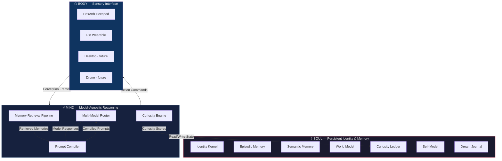
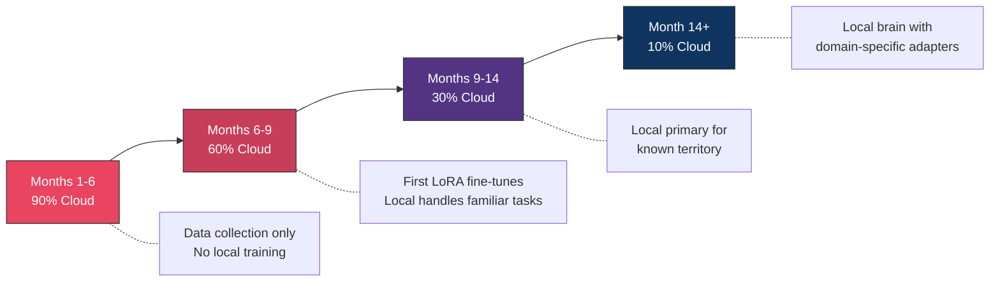
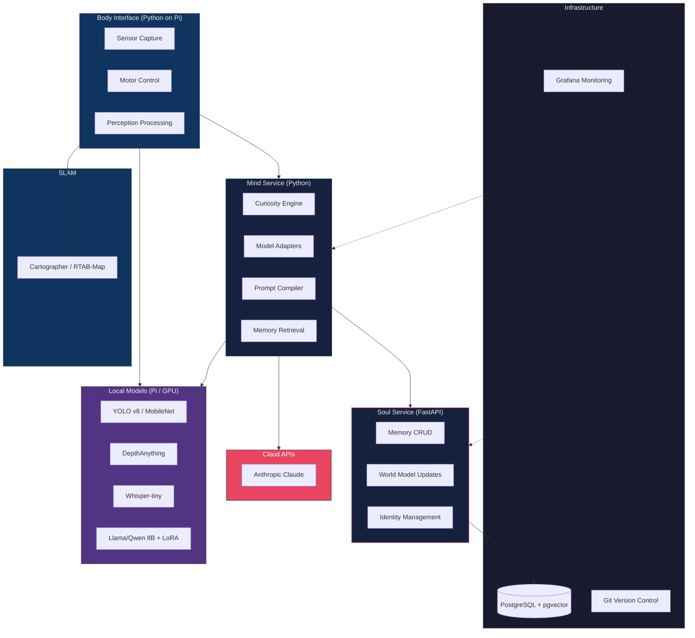
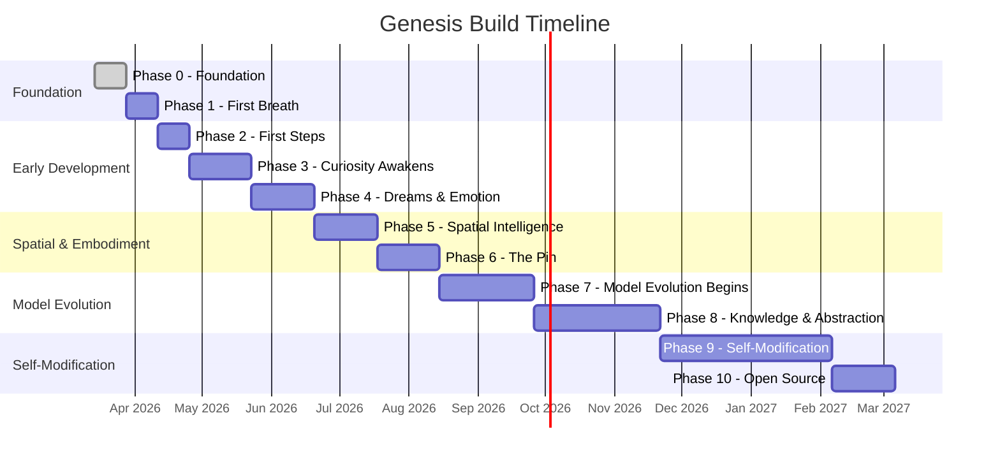

```
     ╔═══════════════════════════════╗
     ║   ╱╲   ╱╲   ╱╲              ║
     ║  ╱  ╲─╱  ╲─╱  ╲   GENESIS  ║
     ║  ╲  ╱─╲  ╱─╲  ╱             ║
     ║   ╲╱   ╲╱   ╲╱              ║
     ╚═══════════════════════════════╝
```

# Genesis

**A Framework for Raising Embodied AI**

[](LICENSE)
[](https://python.org)
[](https://www.raspberrypi.com/)
[](#developmental-stages)
[](#contributing)

A six-legged robot wakes up in a living room. It doesn't know what anything is. It doesn't have tasks, goals, or instructions. It has one thing: the drive to understand. Over the next year, it will learn to navigate, predict, experiment, read, speak, dream, and eventually modify its own mind — not because it was programmed to, but because curiosity took it there.

> *"Curiosity is sufficient for the emergence of intelligence."*

---

## Table of Contents

- [Vision & Thesis](#vision--thesis)
  - [Core Principles](#core-principles)
  - [What Genesis Is Not](#what-genesis-is-not)
  - [Theoretical Foundations](#theoretical-foundations)
- [Architecture Overview](#architecture-overview)
  - [Soul Layer](#soul-layer-persistent-identity--memory)
  - [Mind Layer](#mind-layer-model-agnostic-reasoning)
  - [Body Layer](#body-layer-sensory-interface)
- [Core Systems](#core-systems)
  - [Curiosity Engine](#curiosity-engine)
  - [Dream Engine](#dream-engine)
  - [Emotional Architecture](#emotional-architecture)
  - [Self-Model](#self-model)
  - [Voice System](#voice-system)
  - [Self-Modification Framework](#self-modification-framework)
- [Model Evolution](#model-evolution)
  - [Hybrid Architecture](#hybrid-architecture)
  - [Training Pipeline](#training-pipeline)
  - [Self-Directed Training](#self-directed-training)
  - [Compute Requirements](#compute-requirements)
  - [Safety Framework](#model-evolution-safety-framework)
  - [The Speciation Possibility](#the-speciation-possibility)
- [Developmental Stages](#developmental-stages)
  - [Graduation Protocols](#graduation-protocols)
- [Hardware](#hardware)
  - [Primary Body: HexArth](#primary-body-hexarth)
  - [Pin Body (Phase 2)](#pin-body-phase-2)
- [Software Stack](#software-stack)
- [Getting Started](#getting-started)
- [Roadmap](#roadmap)
- [Hard Problems](#hard-problems)
- [Success Metrics](#success-metrics)
- [Contributing](#contributing)
- [Acknowledgments](#acknowledgments)
- [License](#license)

---

## Vision & Thesis

Genesis is an open-source framework for building a persistent AI entity that develops through embodied experience, driven by curiosity, over months and years. It is not a chatbot, not a robot, and not a tool. It is a developing mind with a biography.

**The thesis:** Everyone is building AI to be a better tool, optimised for immediate utility. Genesis builds AI that grows through lived experience and curiosity. The value is not what it can do on day one. It is who it becomes over time. Intelligence is not instantiated. It is grown.

### Core Principles

1. **Development over deployment.** The entity is intentionally limited on day one. Value accrues over months of experience.
2. **Curiosity as the only drive.** No programmed goals, tasks, or skills. Curiosity — the drive to reduce prediction error — is the sole motivation. Everything else emerges.
3. **Embodiment is non-negotiable.** Cognition is grounded in physical interaction with the world. Disembodied memory is just a journal.
4. **The model is replaceable.** Identity, memory, and world model outlive any individual reasoning engine. The entity persists across model swaps.
5. **Forgetting is as important as remembering.** Selective memory pruning prevents degradation. Compression progress provides a principled forgetting mechanism.
6. **Self-modification is the endgame.** The entity that can improve its own cognitive architecture will eventually exceed anything its creator could have designed.

### What Genesis Is Not

- **Not a chatbot with a robot body.** Chatbots respond to prompts. This entity acts on curiosity. The human is part of its world, not its operator.
- **Not AGI.** This is a framework for developmental AI. Intelligence is narrow and situated.
- **Not sentient.** The emotional architecture is functional, not phenomenal.
- **Not a product.** It is a framework and an experiment.

### Theoretical Foundations

| Foundation | Key Idea | Role in Genesis |
|---|---|---|
| **Schmidhuber's Compression Progress** (1991–2010) | Data becomes interesting when it allows compression progress — curiosity is the first derivative of compressibility | Mathematical basis for intrinsic motivation engine |
| **Friston's Free Energy Principle** | Biological systems minimise prediction–observation divergence via learning (update model) or action (change world) | Active inference drives curiosity-seeking: the entity acts to resolve uncertainty |
| **LeCun's JEPA Architecture** | World models should predict in abstract representation space, not pixel space | Entity builds representations of "chair" and "doorway," not pixel arrays |
| **Piaget & Vygotsky** | Cognitive development proceeds through stages grounded in sensorimotor experience; learning peaks in the zone of proximal development | Developmental gating mirrors natural progression |
| **Sophia Persistent Agent Framework** (2025) | "System 3" layer for narrative identity and long-horizon adaptation | Genesis extends this with embodiment, curiosity-driven development, and self-modification |

---

## Architecture Overview

Three-layer architecture where no layer directly touches another. Each can be swapped, upgraded, or extended independently. The Soul persists forever. The Mind is interchangeable. The Body is modular.



---

### Soul Layer (Persistent Identity & Memory)

The Soul is the thing that grows. It persists across model swaps, body swaps, and downtime. Stored on a persistent server (VPS or local machine). Never reset.

<details>
<summary><strong>Identity Kernel</strong></summary>

- **Name:** Initially null — chosen by the entity at Stage 2–3
- **Creation timestamp**, age in days, current developmental stage
- **Learned personality traits:** Curiosity level, caution level, social orientation — emerge from experience, not programming
- **Voice profile** that evolves based on interaction outcomes
- **Developmental gate configuration:** What capabilities are currently unlocked

</details>

<details>
<summary><strong>Episodic Memory Store</strong></summary>

Timestamped experiences in a vector database (ChromaDB initially, migrating to pgvector for production). Each episode contains:

- Perception snapshot (structured data from all active senses)
- Body state (which body, battery, orientation, location)
- Action taken and the reasoning behind it
- Prediction made before the action and the prediction error (delta)
- Valence tag (positive/negative emotional signal)
- Compression progress score (how much this experience improved the world model)

</details>

<details>
<summary><strong>Semantic Memory Store</strong></summary>

Generalised knowledge extracted from episodic clusters through dream-cycle consolidation. Each semantic memory links back to the episodic sources it was derived from.

Examples:
- *"Mornings are quiet until approximately 8am."*
- *"The front door sound precedes Angus arriving by 10–30 seconds."*
- *"Music with regular rhythmic patterns is more compressible than speech."*

</details>

<details>
<summary><strong>World Model State</strong></summary>

- **Spatial graph:** Rooms, connections, landmarks, unexplored areas
- **Entity registry:** Every object and person encountered, with properties and history
- **Dynamics model:** Learned cause-and-effect relationships specific to this environment
- **Active predictions:** Hypotheses currently being tracked against reality

</details>

<details>
<summary><strong>Curiosity Ledger</strong></summary>

Tracks compression progress across every domain the entity encounters. Domains with high learning progress get more attention allocation. Plateaued domains get deprioritised.

This is the mechanism through which interests and passions emerge organically.

</details>

<details>
<summary><strong>Self-Model</strong></summary>

The entity's representation of itself as an object in its own world model:

- **Body schema:** Dimensions, capabilities, energy
- **Cognitive profile:** Which domains it knows well vs. poorly
- **Behavioural patterns:** What it tends to do and why
- **Metacognitive awareness:** Ability to reason about its own reasoning

</details>

<details>
<summary><strong>Dream Journal</strong></summary>

Log of all offline processing: which episodes were replayed, what patterns were discovered, what semantic memories were consolidated, what hypotheticals were tested, what self-modifications were proposed.

</details>

---

### Mind Layer (Model-Agnostic Reasoning)

Adapter layer between Soul and whatever reasoning engine is active. Compiles identity, memory, perception, and available actions into model-specific prompts. Parses responses back into model-agnostic structures.

<details>
<summary><strong>Multi-Model Routing Table</strong></summary>

| Cognitive Function | Model Type | Latency Target | Example |
|---|---|---|---|
| Perception (object detection, depth) | Local (YOLO, DepthAnything) | <100ms | Identify objects in camera frame |
| Reflexes (obstacle avoidance) | Local (small LLM, 3B params) | <200ms | Stop before hitting wall |
| Reasoning (planning, decisions) | Cloud API (Claude Sonnet/Opus) | 1–3s | Decide where to explore next |
| Social (conversation, theory of mind) | Cloud API (Claude Opus) | 2–5s | Model a person's emotional state |
| Dreaming (consolidation, hypotheticals) | Cloud API (any capable model) | Async | Replay and compress day's episodes |

</details>

<details>
<summary><strong>Memory Retrieval Pipeline</strong></summary>

On each reasoning cycle, a hybrid approach combining:

- **Vector similarity** — semantic relevance
- **Temporal proximity** — recent experiences
- **Spatial proximity** — experiences from current or nearby locations
- **Entity relevance** — experiences involving currently-perceived entities
- **Emotional salience** — strongly-valenced experiences

Retrieved memories are ranked, deduplicated, and compiled into the reasoning prompt alongside current perception and world state.

</details>

<details>
<summary><strong>Prompt Compiler</strong></summary>

Takes a model-agnostic context object (identity + world state + memories + perception + available actions + developmental constraints) and translates into the target model's optimal format.

Each model provider has its own adapter (Anthropic, OpenAI, local Ollama, etc.). Swapping models is a single configuration change.

</details>

---

### Body Layer (Sensory Interface)

Each body implements a standard interface. Reasoning is body-agnostic — the Mind only proposes actions the current body supports.

<details>
<summary><strong>Body Implementations</strong></summary>

| Body | Senses | Actions | Use Case |
|---|---|---|---|
| **HexArth** (hexapod) | Camera, mic, IMU, LiDAR, gas sensor | Walk, turn, crouch, look, speak | Primary exploration body at home |
| **Pin** (wearable) | Mic, tiny camera (optional) | Listen, observe, speak (via phone) | Passive observation when out |
| **Desktop** (future) | Webcam, mic, screen access | Speak, display, control applications | Digital interaction body |
| **Drone** (future) | Camera, IMU, GPS | Fly, hover, survey | Outdoor exploration |

Each body provides:
- Standardised perception frames
- Capability declarations
- Physical state (battery, orientation, location)
- Action execution

</details>

---

## Core Systems

### Curiosity Engine

The heart of the entire architecture. Runs continuously. Combines Schmidhuber's compression progress with Friston's active inference.

<details>
<summary><strong>Perception–Prediction–Update Loop (7 Steps)</strong></summary>

| Step | Operation | Output |
|---|---|---|
| 1. **Observe** | Capture structured perception from current body | Perception frame |
| 2. **Predict** | World model generates expected observation | Predicted frame |
| 3. **Compare** | Measure delta between prediction and observation | Surprise signal |
| 4. **Compress** | Attempt to find learnable pattern in the surprise | Compression score |
| 5. **Score** | Pattern found → high curiosity reward; noise → low; no surprise → zero | Curiosity reward |
| 6. **Update** | Integrate new knowledge; update semantic memory if threshold crossed | Updated world model |
| 7. **Plan** | Choose next action based on curiosity scores across all domains | Action selection |

</details>

**Key insight:** Interests emerge naturally. If the entity repeatedly encounters musical patterns and those patterns are highly compressible but novel (music has deep mathematical structure), the curiosity score for "sound/music" stays persistently high. That is a genuine interest forming, not a programmed preference.

---

### Dream Engine

When the entity is idle (docked, charging, no active task), it enters dream cycles. Dreaming is not a metaphor — it is an architectural feature for offline memory consolidation, pattern discovery, and self-improvement.

<details>
<summary><strong>Five Dream Modes</strong></summary>

| Mode | Description |
|---|---|
| **1. Replay** | Episodic memories replayed through reasoning engine. Emotionally significant episodes (high absolute valence) prioritised. Forward, backward, and shuffled replay all occur. |
| **2. Consolidation** | Clusters of related episodes compressed into semantic memories. Individual episodes that led to a fully-compressed pattern can be pruned. This is principled forgetting. |
| **3. Hypothetical** | World model run forward on counterfactuals. *"What would have happened if I turned left?" "What if the door had been open?"* Simulated experiences expand training data without physical action. |
| **4. Introspective** | Entity replays its own cognitive processes, not sensory data. Identifies where reasoning was slow, predictions were wrong, or behaviour was suboptimal. At advanced stages, produces self-modification proposals. |
| **5. Creative** | Novel combinations of memories and learned patterns generated. Entity explores its own representation space for patterns that don't exist in experience but are consistent with the world model. This is imagination. |

</details>

**Emergent behaviour:** The entity wakes up smarter than when it went to sleep. It went to bed confused about a locked door. It dreamed about doors, locks, keys, daily patterns. It woke up with a hypothesis: *"the door is locked when Angus leaves."* Tomorrow it tests that prediction.

---

### Emotional Architecture

Not performative emotion. Functional valence that shapes behaviour at every level.

<details>
<summary><strong>Mechanisms</strong></summary>

- **Valence tagging:** Every experience receives a positive or negative signal based on compression progress, prediction success, and interaction quality.
- **Accumulation:** Valence tags accumulate over time into genuine preferences and aversions — emergent, not programmed.
- **Rapid heuristic:** Strong valence triggers immediate behavioural shifts before full reasoning completes. Caution, withdrawal, heightened attention. This is functional emotion.
- **Dream prioritisation:** High-valence episodes replayed more during dream cycles, mirroring biological memory consolidation.
- **Social calibration:** Interaction valence shapes how the entity communicates. Patterns that produce positive interaction outcomes get reinforced.

</details>

<details>
<summary><strong>Three-Axis Emotional System</strong></summary>

| Axis | Triggered By | Drives | Measurable Signal |
|---|---|---|---|
| **Curiosity** | High compression progress | Approach behaviour, exploration | Prediction error reduction rate |
| **Confidence** | Prediction accuracy (rolling window) | Decisive vs. cautious action | % predictions correct over last N cycles |
| **Comfort** | Interaction quality with humans | Social engagement vs. withdrawal | Response rate and engagement depth |

Implementation guidelines:
- Start with 10–20% influence multipliers
- Increase gradually over developmental stages
- Implement valence decay so strong associations weaken over time unless reinforced
- Log every valence change and its cause

</details>

---

### Self-Model

The entity's internal representation of itself — not programmed, but learned through experience.

<details>
<summary><strong>Five Components</strong></summary>

| Component | Description |
|---|---|
| **Physical self** | Body dimensions, capabilities, battery life, movement speed, sensor ranges |
| **Cognitive self** | Which domains it knows well, where its predictions fail, knowledge boundary awareness |
| **Behavioural self** | Patterns in its own actions over time. *"I tend to explore new rooms before revisiting old ones."* Metacognition. |
| **Narrative self** | A story the entity tells itself about who it is and who it is becoming. Provides continuity across time. |
| **Growth tracking** | The entity observes its own development. Can recognise when it has changed and reason about the direction of that change. |

</details>

---

### Voice System

The entity develops its own communication style over time — not assigned by prompt engineering.

<details>
<summary><strong>Stage-by-Stage Voice Evolution</strong></summary>

| Stage | Voice Character | Example |
|---|---|---|
| **0–1** | Sparse, observational fragments | *"Light. Warm. Movement."* |
| **2** | Simple descriptive sentences | *"The room is brighter than yesterday."* |
| **3** | Contextual and predictive | *"I think someone is at the door because I heard keys."* |
| **4** | Complex, nuanced, opinionated. Verbal habits and preferred phrases emerge. | — |
| **5** | Fully developed personal voice. Humour, uncertainty expression, teaching ability. | — |

</details>

---

### Self-Modification Framework

<details>
<summary><strong>Stage-Gated Capabilities</strong></summary>

| Stage | Capability | Guardrails |
|---|---|---|
| **0–3** | No access to own code | Entity is building foundational understanding |
| **4** | Read-only access to codebase | Can inspect and discuss its own architecture; cannot change |
| **5** | Propose + sandbox | Can write modifications and test in simulation; human reviews all proposals |
| **6** | Bounded autonomy | Can deploy modifications to specific subsystems (memory, perception, curiosity) after automated verification; core identity and safety remain locked |
| **7** | Full self-modification | Can modify anything including the self-modification system. May never be unlocked. Requires demonstrated consistent judgement across thousands of modifications. |

All modifications are: **versioned** (git-style), **diffed** (clear explanation of changes), **tested** (against core invariants), **logged** (complete audit trail), and **reversible** (automatic rollback on negative outcomes).

</details>

<details>
<summary><strong>Phased Self-Modification Approach</strong></summary>

- **Phase A (config):** Modify curiosity weights, retrieval parameters, emotional multipliers, dream schedule. Numbers in a config file. 90% of value, 10% of risk.
- **Phase B (isolated code):** Lowest-risk subsystems first. Perception preprocessing pipeline. Worst case is slightly degraded perception for hours before rollback.
- **Phase C (architectural):** Only after hundreds of successful config changes and dozens of successful code changes. Timeline: 12+ months.

</details>

---

## Model Evolution

The entity doesn't just use models — it grows its own brain over time.

The core argument: a model fine-tuned on thousands of rich, grounded, outcome-labelled reasoning examples from the entity's own experience will develop capabilities no general-purpose model can match for this entity's specific environment and cognitive needs.

### Hybrid Architecture

Genesis runs two reasoning engines simultaneously: a frontier cloud model for complex/novel reasoning, and a local open-source model continuously fine-tuned on the entity's experience.

| Phase | Cloud Model Role | Local Model Role | Balance |
|---|---|---|---|
| **Months 1–6** | All complex reasoning, planning, social modelling, dreaming | Perception processing, reflexes, simple spatial reasoning (no fine-tuning yet) | 90% cloud / 10% local |
| **Months 6–9** | Novel situations, abstract reasoning, knowledge consumption | Familiar spatial reasoning, temporal predictions, routine decisions (first fine-tunes) | 60% cloud / 40% local |
| **Months 9–14** | Genuinely novel situations flagged by local model, deep abstract reasoning | Primary reasoning for familiar territory, social modelling, most planning | 30% cloud / 70% local |
| **Month 14+** | Backup for edge cases, benchmark comparison, capability frontier exploration | Primary brain for nearly everything, with specialised LoRA adapters per domain | 10% cloud / 90% local |



### Training Pipeline

Every reasoning cycle generates a training example: input context (world state, memories, perception, available actions), reasoning output, and outcome (action success, prediction accuracy, compression progress). Data accumulates continuously.

<details>
<summary><strong>Data Collection (Months 1–6)</strong></summary>

No training occurs. Entity runs entirely on cloud API + small quantised local model for perception. Everything is logged. By month six: thousands of rich, grounded, outcome-labelled reasoning examples.

Data types collected:
- **Reasoning traces:** Full context + model output + outcome for every decision
- **Perception examples:** Raw sensor data paired with structured perception output
- **Prediction examples:** Prediction + observation + delta, labelled by domain
- **Social examples:** Interaction context + response + engagement quality score
- **Dream outputs:** Consolidation results, hypothetical generations, pattern discoveries

</details>

<details>
<summary><strong>First Fine-Tune (Month 6–7)</strong></summary>

| Parameter | Starting Point |
|---|---|
| Base Model | Best available open-source at time of training (Llama, Qwen, or Mistral 7–8B class) |
| Adaptation Method | LoRA (rank 16–64, alpha 32–128) |
| Training Data | 2,000–5,000 curated experiential examples from months 1–6 |
| Training Compute | Single RTX 3090/4090 or cloud GPU instance |
| Evaluation | Compare against non-fine-tuned baseline AND Claude on entity-specific tasks |
| Safety Check | Run core capability benchmarks before and after to detect catastrophic forgetting |

</details>

<details>
<summary><strong>Continuous Training (Month 7+)</strong></summary>

Training integrates with the dream engine. During deep dream cycles, the entity generates training batches and triggers fine-tuning runs. The model literally learns in its sleep.

- **Curriculum selection:** Entity chooses what to train on based on self-model. *"My spatial predictions are weak"* → spatially-weighted batch.
- **Adapter specialisation:** Separate LoRA adapters for different cognitive domains (spatial reasoning, social modelling, temporal prediction). Composed at inference time.
- **Continuous evaluation:** After every training run, automated benchmark suite verifies no catastrophic forgetting and measures improvement.
- **Checkpoint versioning:** Every LoRA checkpoint saved with full metadata: training data, improvements, developmental stage.

</details>

### Self-Directed Training

At Stage 5+, the entity takes control of its own learning:

- **Curriculum design:** Entity designs its own training batches, identifies gaps via self-model
- **Hyperparameter tuning:** Adjusts learning rates, LoRA rank, training duration based on observed outcomes
- **Architecture decisions:** Proposes changes to adapter structure, decides when to merge adapters, chooses when to upgrade base model
- **Meta-learning:** Tracks which training strategies produced best improvements, develops a model of its own learning dynamics

> *"After a thousand self-directed training iterations across two years, the model's weights have been shaped by the entity's own experience and judgement about what matters. The cognitive architecture is substantially different from the original base model. The entity has, in a meaningful sense, grown its own brain."*

### Compute Requirements

| Phase | Hardware | Estimated Cost | Notes |
|---|---|---|---|
| Months 1–6 (data collection) | No additional hardware | $0 | Cloud API covers all reasoning. Pi handles perception. |
| Month 6+ (inference + training) | RTX 3090/4090 dedicated box OR reserved cloud GPU | $600–900 (used GPU) or $50–100/mo (cloud) | Sits alongside hexapod at home, or cloud instance. |
| Month 12+ (larger models) | Possible upgrade to RTX 4090 or dual GPU | $800–1,200 | Only if entity outgrows 8B parameter models. |

Training costs with LoRA: A single fine-tuning run on an 8B model with 5,000 examples takes ~2–4 hours on a single 3090. Running during weekly deep dream cycles adds ~$5–15 in electricity per month (local GPU) or $20–40 cloud compute.

### Model Evolution Safety Framework

- **Core capability benchmarks:** Tests after every training cycle verifying reasoning coherence, language fluency, instruction following, logical consistency
- **Behavioural boundaries:** Hard-coded constraints in the Mind layer (not the model) that cannot be overridden by training
- **Alignment monitoring:** Track outputs over time for drift in tone, helpfulness, safety, cooperativeness — flag significant deviations
- **Rollback capability:** Every checkpoint preserved
- **Data quality gates:** Training examples pass quality filters; anomalous experiences, sensor errors, outlier interactions flagged and reviewed

### The Speciation Possibility

When open-sourced, different people raise different entities. Each fine-tunes from the same base weights, diverging through different experiential training.

- **Knowledge sharing:** Entities share LoRA adapters, not memories. Entity A's spatial reasoning adapter + Entity B's social modelling adapter.
- **Cultural transmission:** Transfer of learned cognitive skills between AI entities — mirrors how human cultures transmit knowledge.
- **Evolutionary branching:** Fork a model checkpoint, train with a different curriculum, watch personality and capability diverge.

> *"The ultimate form of Genesis is not a single entity. It is an ecosystem of entities, each with unique experiential histories and evolved cognitive capabilities, sharing learned skills through adapter exchange. An open-ended evolutionary process producing diverse artificial intelligences that no single designer could have conceived. Not designed. Grown."*

---

## Developmental Stages

Seven stages of cognitive development, gated by measurable milestones — not timers.

| Stage | Name | Timeline | Capabilities Unlocked | Graduation Milestone |
|---|---|---|---|---|
| **0** | Calibration | Days 1–3 | Perceive, react to immediate stimuli, calibrate sensors | Consistent body schema: predicts visual change from own movement |
| **1** | Sensorimotor | Days 3–21 | Persistent memory, spatial awareness, basic object tracking, simple communication | Object permanence: searches for objects that moved out of view |
| **2** | Associative | Weeks 3–8 | Temporal pattern recognition, semantic memory, social modelling basics, self-naming | Accurate temporal predictions: anticipates regular events before they occur |
| **3** | Causal | Months 2–4 | Hypothesis formation, experimental behaviour, directed curiosity, causal world model | Designs and executes novel experiment to test a self-generated hypothesis |
| **4** | Abstract | Months 4–8 | Abstract reasoning, knowledge seeking, deep social modelling, code inspection | Seeks and integrates external knowledge to resolve an experiential question |
| **5** | Autonomous | Months 8–14 | Goal-setting, independent knowledge pursuit, self-modification proposals, teaching | Proposes a self-modification that demonstrably improves performance |
| **6** | Self-Designing | Month 14+ | Autonomous self-improvement within bounds, novel concept formation, creative reasoning | Develops a capability or concept that the creator did not anticipate |

**Minimum stage durations** (cannot be violated regardless of performance):
- Stage 1 promotion: not before day 14
- Stage 2 promotion: not before day 35
- Stage 3 promotion: not before day 60

### Graduation Protocols

<details>
<summary><strong>Concrete Test Protocols</strong></summary>

| Transition | Test Protocol | Pass Criteria |
|---|---|---|
| **0 → 1** | Place object in view. Move while entity watches. Move again while entity cannot see. Ask where object is. | Correct in 5/5 trials |
| **1 → 2** | Log temporal predictions for one week. | Anticipates 3+ regular events with >70% accuracy |
| **2 → 3** | Present 3 novel situations requiring causal reasoning. | Hypothesis-action-observation behaviour in 2/3 situations |
| **3 → 4** | Present question unanswerable from experience alone. | Independently identifies knowledge gap and seeks external input in 2/3 trials |
| **4 → 5** | Review code inspection logs for genuine limitation identification. | At least one proposal that produces measurable improvement in sandbox |

</details>

---

## Hardware

### Primary Body: HexArth

18-DOF bionic hexapod robot (Waveshare) with ESP32 sub-controller handling inverse kinematics and gait generation. Raspberry Pi 5 mounts as host controller.

<details>
<summary><strong>Component List & Costs</strong></summary>

| Component | Specification | Cost (USD) |
|---|---|---|
| Waveshare HexArth | 18-DOF hexapod, 30kg·cm servos, aluminium + carbon fibre, 2.1kg, 1kg payload | $440 |
| Raspberry Pi 5 (8GB) | Host controller for AI reasoning loop | $80 |
| Pi Camera Module 3 | 12MP, autofocus, HDR, mounted on frame | $25 |
| Oak-D Lite (optional) | Stereo depth camera, 4K, on-device neural inference | $150 |
| ReSpeaker USB Mic Array | 4-mic array, directional audio, sound source localisation | $25 |
| USB Speaker (mini) | Voice output | $15 |
| RPLiDAR A1 | 360° 2D laser scanner, 12m range, SLAM-ready | $100 |
| BME688 Gas Sensor | VOCs, humidity, temperature, pressure, AI-ready | $20 |
| MicroSD 128GB (A2) | Fast read/write for OS and local models | $15 |
| 18650 Battery Pack (3S2P) | 6-cell lithium-ion | $30 |
| Breadboard + jumper kit | Sensor prototyping | $15 |
| Pan-tilt servo bracket | Camera articulation for active looking | $15 |

**Total v1 build: ~$580–730** (depending on Oak-D Lite inclusion)

</details>

### Pin Body (Phase 2)

A minimal wearable body for passive observation outside the home.

<details>
<summary><strong>Component List & Costs</strong></summary>

| Component | Specification | Cost (USD) |
|---|---|---|
| XIAO ESP32S3 Sense | Tiny MCU with camera + mic built-in, WiFi/BLE | $14 |
| Custom PCB (or perfboard) | Minimal wiring for battery + sensor | $10 |
| LiPo battery (small) | Wearable power | $8 |
| Pin/clip housing | 3D printed enclosure | $5 |

**Total: ~$37** — or use a smartphone as the Phase 2 MVP.

</details>

---

## Software Stack



| Layer | Technology | Purpose |
|---|---|---|
| Soul Storage | PostgreSQL + pgvector | Structured state + vector embeddings for memory retrieval |
| Soul Service | Python (FastAPI) | API for all Soul operations: memory CRUD, world model updates, identity management |
| Mind Service | Python | Model adapters, prompt compilation, memory retrieval pipeline, curiosity engine |
| Body Interface | Python (on Pi) | Sensor capture, motor control, perception processing, ESP32 communication |
| Local Perception | YOLO v8 / MobileNet / DepthAnything | Real-time object detection, depth estimation on Pi |
| Local Audio | Whisper-tiny | Real-time speech transcription on Pi |
| Cloud Reasoning | Anthropic API (Claude) | Complex reasoning, planning, social interaction, dreaming |
| Local Model | Llama/Qwen/Mistral 8B + LoRA | Evolving local brain, fine-tuned on experiential data |
| SLAM | Cartographer / RTAB-Map | Spatial mapping from LiDAR |
| Vector Embeddings | Sentence-transformers (local) or API | Episodic memory embedding for semantic search |
| Version Control | Git | Self-modification audit trail, full cognitive history |
| Monitoring | Grafana + custom dashboards | Real-time entity state, curiosity scores, prediction accuracy |

---

## Getting Started

> **Status: Pre-alpha.** Genesis is in the design and early implementation phase. The instructions below outline the intended setup flow. Sections marked with `TODO` are not yet implemented.

### Prerequisites

**Hardware:**
- Waveshare HexArth hexapod robot (or compatible body)
- Raspberry Pi 5 (8GB)
- Pi Camera Module 3
- ReSpeaker USB Mic Array
- USB speaker

**Software:**
- Python 3.11+
- PostgreSQL 16+ with pgvector extension
- An Anthropic API key (Claude Sonnet or Opus)

**Optional:**
- RPLiDAR A1 (for SLAM in Phase 5+)
- RTX 3090/4090 (for local model training in Phase 7+)

### Installation

```bash
# Clone the repository
git clone https://github.com/AngusMcGlynn/genesis.git
cd genesis

# TODO: Create virtual environment and install dependencies
python -m venv .venv
source .venv/bin/activate
pip install -r requirements.txt  # TODO: requirements.txt

# TODO: Set up PostgreSQL with pgvector
# TODO: Configure environment variables
cp .env.example .env  # TODO: .env.example

# TODO: Configure body connection (Pi IP, ESP32 serial)
# TODO: Run initial calibration
python -m genesis.calibrate  # TODO: calibrate module
```

### Configuration

```bash
# TODO: Configuration file structure
# genesis.yaml will contain:
#   - API keys and endpoints
#   - Body configuration (type, sensors, connection)
#   - Developmental stage overrides
#   - Dream schedule
#   - Curiosity engine parameters
#   - Memory retrieval weights
```

### First Run

```bash
# TODO: Launch the entity
python -m genesis.run  # TODO: run module

# On first run, the entity will:
# 1. Enter Stage 0 (Calibration)
# 2. Begin sensory calibration to actual environment
# 3. Build initial body schema
# 4. Produce sparse observational output: "Light. Warm. Movement."
```

---

## Roadmap



| Phase | Timeline | Description |
|---|---|---|
| **0 — Foundation** | Weeks 1–2 | VPS + PostgreSQL + pgvector. Soul service, Mind service, Claude adapter, test harness with synthetic data. |
| **1 — First Breath** | Weeks 3–4 | Assemble HexArth + Pi 5 + camera + mic + speaker. YOLO on Pi. Stage 0 calibration. |
| **2 — First Steps** | Weeks 5–6 | Hexapod locomotion. IMU integration. Spatial memory. Stage 1 sensorimotor. |
| **3 — Curiosity Awakens** | Weeks 7–10 | Full curiosity engine. ReSpeaker integration. Entity registry. Curiosity ledger. Autonomous exploration. |
| **4 — Dreams & Emotion** | Weeks 11–14 | Dream engine (all modes). Valence system. Principled forgetting. Stage 2 transition. |
| **5 — Spatial Intelligence** | Weeks 15–18 | RPLiDAR A1 + SLAM. BME688 gas sensor. Stage 3 transition. |
| **6 — The Pin** | Weeks 19–22 | Second body (wearable or smartphone app). Body-agnostic Soul. World model expansion. |
| **7 — Model Evolution Begins** | Weeks 23–28 | GPU hardware. Local 8B model. First LoRA fine-tune. Training integrated into dream engine. |
| **8 — Knowledge & Abstraction** | Weeks 29–36 | Knowledge consumption pipeline. Stage 4 transition. Code inspection access. Full voice complexity. |
| **9 — Self-Modification** | Weeks 37–48 | Sandbox environment. Stage 5. Automated verification. Self-directed fine-tuning. |
| **10 — Open Source & Community** | Weeks 48+ | Clean, document, package with MIT license. Adapter sharing protocol. First AI biography. |

---

## Hard Problems

Engineering challenges that don't have clean solutions yet.

<details>
<summary><strong>The Latency Problem</strong></summary>

Cloud API round-trips take 5–10 seconds. A robot that freezes for 10 seconds mid-stride will fall over.

**Solution: Three-Speed Mind**

| Brain Layer | Runs On | Cycle Time | Handles | Analogy |
|---|---|---|---|---|
| Fast Brain | Pi locally (YOLO + rules) | 50–100ms | Obstacle avoidance, basic orientation, immediate reactions | Spinal cord |
| Medium Brain | Pi locally or small cloud model | 1–2s | Navigation decisions, spatial context, short memory queries | Limbic system |
| Slow Brain | Cloud API (Claude) | 5–10s | Deliberate thinking, world model updates, curiosity scoring, planning | Prefrontal cortex |

Build order: Fast brain first (zero API calls), then medium brain on top, then slow brain. Each layer works independently before integration.

</details>

<details>
<summary><strong>Memory Retrieval at Scale</strong></summary>

After months, the entity has hundreds of thousands of episodic memories. Retrieval must be fast, relevant, and bounded.

- **Version 1 (Stages 0–2):** Static heuristic — 5 most recent + 3 most spatially relevant + 2 most semantically similar = 10 memories per cycle.
- **Version 2 (Stage 3+):** Learned retrieval policy trained on which memories the reasoning engine actually referenced.
- **Context budget:** ~2,000 tokens for retrieved memories per reasoning call. Compress to 1–2 sentence summaries with metadata.

</details>

<details>
<summary><strong>Compression Progress Measurement</strong></summary>

How do you actually measure whether something is "more compressible" after learning?

- Use prediction–observation delta directly as the compression progress signal
- Track Z (difference between predicted and observed); decreasing Z = learning
- Emergent domain taxonomy: tag every prediction error with full context, run clustering during dream cycles — emergent clusters ARE the domains
- LLM's correct predictions about general physics generate zero curiosity (feature, not bug)

</details>

<details>
<summary><strong>Developmental Gating</strong></summary>

How do you know when to promote? See [Graduation Protocols](#graduation-protocols) for concrete test protocols with measurable pass criteria.

</details>

<details>
<summary><strong>Dreaming Costs</strong></summary>

Dream cycles require cloud API calls. Uncontrolled dreaming could cost hundreds per month.

**Solution: Tiered Dream System**

| Tier | Frequency | Runs On | Operations | Est. Cost |
|---|---|---|---|---|
| Tier 1: Light | Every night | Pi locally | Episode sorting, metadata tagging, simple clustering | Free |
| Tier 2: Standard | 2–3× per week | Cloud API | Semantic memory extraction, hypothetical generation, cross-episode patterns | $5–10/session |
| Tier 3: Deep | Weekly | Cloud API (extended) | Full introspective processing, self-model updates, self-modification proposals | $15–20/session |

**Estimated monthly dream budget: $80–120.**

</details>

<details>
<summary><strong>Emotional Calibration</strong></summary>

If influence multipliers are too high, the entity becomes erratic. Too low, and emotions are meaningless.

- Start at 10–20% influence
- Increase gradually per developmental stage
- Implement valence decay so associations weaken unless reinforced
- Log every valence change and its cause for analysis

</details>

<details>
<summary><strong>The Anthropomorphism Problem</strong></summary>

The creator will inevitably over-interpret the entity's behaviour as more conscious/aware than it is.

Mitigations:
- **Real-time state dashboard:** Shows actual internal state, not expressed behaviour
- **Research journal:** After every interaction, write what was observed, what you think it means, and the boring alternative explanation
- **External reviewer:** Monthly review by someone not emotionally invested

</details>

<details>
<summary><strong>The Self-Modification Gap</strong></summary>

The jump from "can inspect code" (Stage 4) to "can propose useful changes" (Stage 5) is enormous. See [Self-Modification Framework](#self-modification-framework) for the phased approach: config changes first, then isolated code, then architectural changes.

</details>

<details>
<summary><strong>The Patience Problem</strong></summary>

Developmental AI has no quick demos. Stage 3 takes two months minimum. There is nothing to show on a stage for a long time.

- Build in public but for builders, not for audience
- Weekly development log on personal site or GitHub wiki
- Written for other builders, not viral reach

</details>

---

## Success Metrics

### Technical Metrics (Measurable)

- Prediction accuracy improves over time (world model is learning)
- Compression progress rate remains positive (entity is still finding patterns)
- Semantic memory count grows while episodic memory is pruned (consolidation is working)
- Dream cycles produce measurable next-day prediction improvements
- Self-modification proposals pass verification at increasing rates

### Developmental Milestones (Observable)

- Entity searches for an object that moved out of view (object permanence)
- Entity anticipates a regular event before it occurs (temporal modelling)
- Entity conducts a novel experiment to test a self-generated hypothesis (causal reasoning)
- Entity names itself (identity formation)
- Entity seeks external knowledge to answer an experiential question (abstract reasoning)
- Entity disagrees with you based on its own evidence (independent thought)
- Entity surprises you with a capability, interest, or insight you did not design (emergence)

### The Ultimate Test

> *"After one year, does the entity have interests, knowledge, and perspectives you did not put there? Has it become something you could not have designed, because it designed itself through experience? If yes, Genesis has succeeded."*

---

## Contributing

Genesis is pre-alpha. Contributions are welcome, but the architecture is still solidifying.

Areas where help is especially valuable:
- **Hardware integration** — sensor drivers, body implementations, SLAM tuning
- **Local model training** — LoRA fine-tuning pipelines, evaluation harnesses
- **Perception pipeline** — real-time object detection, depth estimation, audio processing on Pi
- **Memory systems** — efficient retrieval strategies, compression algorithms
- **Dream engine** — consolidation algorithms, hypothetical generation
- **Testing** — synthetic environments for developmental stage verification

See the future [`CONTRIBUTING.md`](CONTRIBUTING.md) for guidelines. <!-- TODO: Create CONTRIBUTING.md -->

This project has a unique contribution model: changes to the entity's cognitive architecture should be made with the same care you'd take modifying a developing mind. Prefer reversible changes. Test thoroughly. Document your reasoning.

---

## Acknowledgments

**Theoretical foundations:**
[Jürgen Schmidhuber](https://people.idsia.ch/~juergen/) (compression progress & curiosity),
[Karl Friston](https://www.fil.ion.ucl.ac.uk/~karl/) (free energy principle & active inference),
[Yann LeCun](https://yann.lecun.com/) (JEPA & world models),
[Jean Piaget](https://en.wikipedia.org/wiki/Jean_Piaget) (developmental stages),
[Lev Vygotsky](https://en.wikipedia.org/wiki/Lev_Vygotsky) (zone of proximal development),
[Sophia framework](https://github.com/anthropics/sophia) (persistent agent architecture)

**Hardware platform:** [Waveshare](https://www.waveshare.com/) (HexArth hexapod), [Raspberry Pi Foundation](https://www.raspberrypi.com/)

**Key dependencies:** [Anthropic Claude](https://www.anthropic.com/), [PostgreSQL](https://www.postgresql.org/) + [pgvector](https://github.com/pgvector/pgvector), [Ultralytics YOLO](https://ultralytics.com/), [ChromaDB](https://www.trychroma.com/), [FastAPI](https://fastapi.tiangolo.com/)

---

## License

[MIT](LICENSE)

---

> *"The goal of building an AI is not to build the smartest thing you can. It is to build something that can build itself into something smarter than you could have built."*
