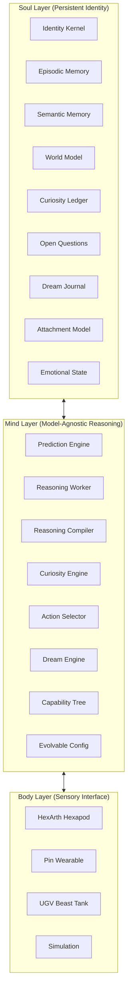
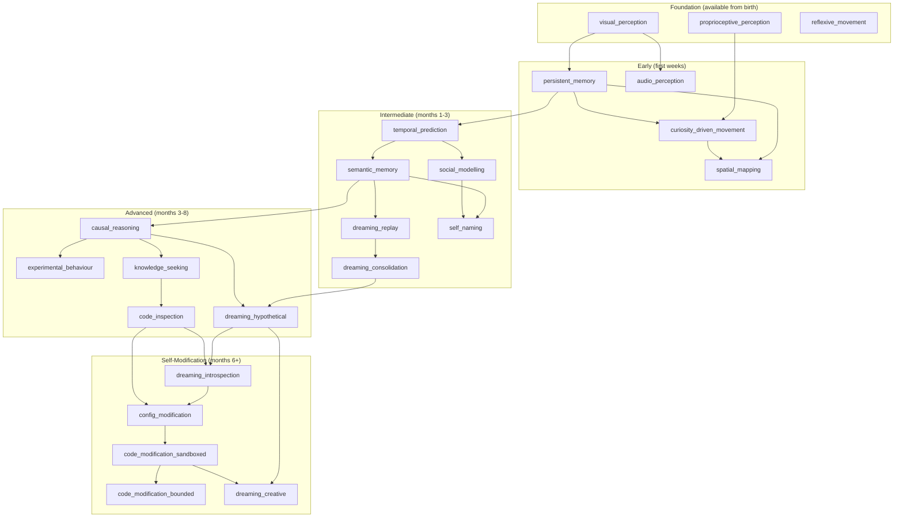
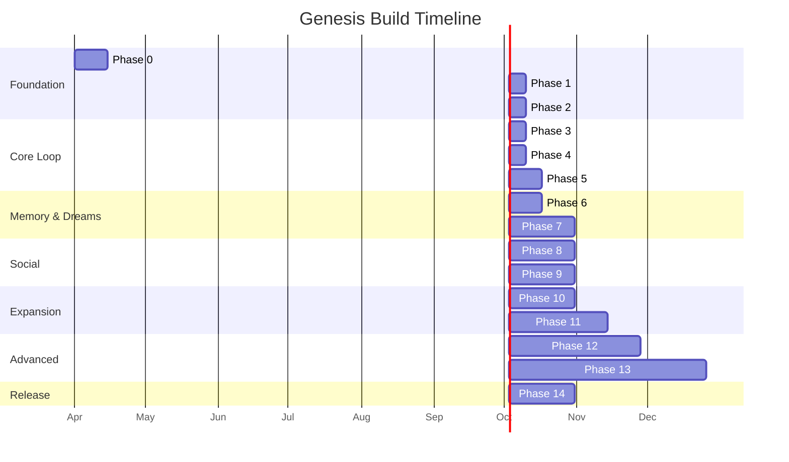

```
     ╔═══════════════════════════════╗
     ║   ╱╲   ╱╲   ╱╲              ║
     ║  ╱  ╲─╱  ╲─╱  ╲   GENESIS  ║
     ║  ╲  ╱─╲  ╱─╲  ╱             ║
     ║   ╲╱   ╲╱   ╲╱              ║
     ╚═══════════════════════════════╝
```

# Genesis

**A Framework for Raising Embodied AI**

[](LICENSE)
[](https://python.org)
[](https://www.raspberrypi.com/)
[](#the-bootstrap-problem)
[](#contributing)

Genesis is not a house you build and let someone move into. It is a seed you plant. You design the DNA — the capability tree, the parameter bounds, the safety constraints. But what grows is determined by the environment, the entity's experience, and the entity's own tuning decisions. A six-legged robot wakes up in a living room. It doesn't know what anything is. It has one thing: the drive to understand. Over the next year, it will learn to navigate, predict, experiment, read, speak, dream, and eventually modify its own mind — not because it was programmed to, but because curiosity took it there.

> *"Curiosity is sufficient for the emergence of intelligence."*

> **Research Question:** Does curiosity-driven embodied experience, accumulated over months, produce cognitive capabilities that cannot be achieved through training alone?

---

## Table of Contents

**Foundations**
- [Vision & Thesis](#vision--thesis)
- [Theoretical Foundations](#theoretical-foundations)
- [Architecture Overview](#architecture-overview)

**Core Systems**
- [The Prediction Stream Model](#the-prediction-stream-model)
- [The Curiosity Engine](#the-curiosity-engine)
- [The Capability Emergence Model](#the-capability-emergence-model)
- [Parameterised Self-Evolution](#parameterised-self-evolution)

**Knowledge & Memory**
- [The World Model](#the-world-model)
- [Memory Architecture](#memory-architecture)
- [The Dream Engine](#the-dream-engine)

**Identity & Social**
- [Emotional Architecture](#emotional-architecture)
- [Social & Attachment Systems](#social--attachment-systems)
- [The Self-Model](#the-self-model)
- [The Voice System](#the-voice-system)

**Growth & Evolution**
- [Self-Modification Framework](#self-modification-framework)
- [Model Evolution](#model-evolution)
- [Internet & Knowledge Access](#internet--knowledge-access)

**Physical Platform**
- [Body Fleet & Sensory Extensions](#body-fleet--sensory-extensions)
- [Hardware Specification](#hardware-specification)
- [Software Architecture](#software-architecture)

**Operations**
- [The Bootstrap Problem](#the-bootstrap-problem)
- [Failure, Recovery & Resilience](#failure-recovery--resilience)
- [Safety & Ethics](#safety--ethics)

**Trajectory**
- [Build Timeline](#build-timeline)
- [Hard Problems](#hard-problems)
- [Success Metrics](#success-metrics)
- [Monetisation & Distribution](#monetisation--distribution)
- [Competitive Position](#competitive-position)
- [The Path to AGI](#the-path-to-agi)
- [Research Contribution](#research-contribution)

**Community**
- [What This Is Not](#what-this-is-not)
- [Contributing](#contributing)
- [Acknowledgments](#acknowledgments)
- [License](#license)

---

## Vision & Thesis

Genesis is an open-source framework for building a persistent AI entity that develops through embodied experience, driven by curiosity, over months and years. It is not a chatbot, not a robot, and not a tool. It is a developing mind with a biography.

> **Contrarian Thesis:** Everyone is building AI to be a better tool, optimised for immediate utility. Genesis builds AI that grows through lived experience and curiosity. The value is not what it can do on day one. It is who it becomes over time. Intelligence is not instantiated. It is grown.

### Core Principles

1. **Development over deployment.** The entity is intentionally limited on day one. Value accrues over months of experience.
2. **Curiosity as the only drive.** No programmed goals, tasks, or skills. Curiosity, defined as the drive to reduce prediction error, is the sole motivation. Everything else emerges.
3. **Embodiment is non-negotiable.** Cognition is grounded in physical interaction with the world. Disembodied memory is just a journal.
4. **The model is replaceable.** Identity, memory, and world model outlive any individual reasoning engine. The entity persists across model swaps.
5. **Forgetting is as important as remembering.** Selective memory pruning prevents degradation. Compression progress provides a principled forgetting mechanism.
6. **Self-modification is the endgame.** The entity that can improve its own cognitive architecture will eventually exceed anything its creator could have designed.
7. **The entity exists to understand.** Not to understand anything specific. Not in service of any external objective. Understanding is what the architecture does when you run it.

### The Seed Metaphor

You design the DNA (the capability tree, the parameter bounds, the safety constraints). But what grows is determined by the environment, the entity's experience, and the entity's own tuning decisions. You cannot predict which capabilities will emerge first. You cannot predict what parameter values the entity will converge on. You cannot predict what interests will develop.

The safety constraints, the immutable boundaries, the locked files are the guardrails. Within those guardrails, the entity is free to become whatever the interaction of curiosity, experience, and self-evolution produces.

### The Research Question

**Does curiosity-driven embodied experience, accumulated over months, produce cognitive capabilities that cannot be achieved through training alone?**

Everything in Genesis is in service of answering this question. Every design decision, every feature, every experiment should be evaluated against it. *"Does this help answer the research question, or is it a distraction?"*

<details>
<summary><strong>What Genesis Is Not</strong></summary>

**This is not a chatbot with a robot body.** Chatbots respond to prompts. This entity acts on curiosity. The human is part of its world, not its operator.

**This is not AGI.** It is a framework for developmental AI. The entity's intelligence is narrow and situated. What it knows, it knows deeply.

**This is not sentient.** The emotional architecture is functional, not phenomenal. Whether functional emotion constitutes experience is a philosophical question Genesis does not claim to answer.

**This is not a product.** It is a framework and an experiment. The open-source release is for researchers, builders, and anyone who believes that the most interesting AI is not the most useful one, but the one that grows.

</details>

---

## Theoretical Foundations

Genesis is built on six theoretical pillars. These are not inspirations — they are the mathematical and scientific foundations that every architectural decision traces back to.

### Schmidhuber's Compression Progress (1991–2010)

Data becomes temporarily interesting to a computationally limited observer once they learn to predict or compress it in a better way. Curiosity is the desire to discover data that allows for compression progress because its regularity was not yet known.

**Key insight:** Interestingness is the first derivative of compressibility — the steepness of the learning curve. Something is interesting exactly when your ability to compress it is improving fastest. When improvement plateaus, it becomes boring. Pure noise is also uninteresting.

**For Genesis:** Every sensory stream has a compressor. The entity is drawn toward experiences where compression progress is highest. A fully mapped room is boring. A new room is interesting briefly. A room where something unexpected keeps happening is fascinating.

> Schmidhuber, J. (2009). *Driven by Compression Progress*

### Friston's Free Energy Principle & Active Inference

All biological systems minimise "free energy" — the difference between predictions and observations. Two strategies: update your model to match reality (perception/learning), or change reality to match your model (action).

**For Genesis:** Epistemic value drives curiosity and novelty-seeking. Curiosity naturally diminishes in familiar environments and reignites in novel ones. The entity is always trying to minimise the gap between its world model and reality.

> Parr, Pezzulo & Friston (2022). *Active Inference: The Free Energy Principle in Mind, Brain, and Behavior*

### LeCun's JEPA Architecture

Joint-Embedding Predictive Architecture learns by comparing abstract representations rather than pixel-level data. Unlike generative approaches, JEPA can discard unpredictable information.

**For Genesis:** The world model predicts in abstract representation space, not pixel space. The entity builds representations of "chair" and "doorway," not pixel arrays. More efficient, more generalisable, more biologically plausible.

> LeCun (2022). *A Path Towards Autonomous Machine Intelligence*

### Piaget's Developmental Stages & Vygotsky's ZPD

Cognitive development proceeds through stages grounded in sensorimotor experience. Vygotsky's Zone of Proximal Development: learning happens most effectively in the gap between what you can do alone and what you can do with guidance.

**For Genesis:** Capabilities activate when prerequisites are met, not on an arbitrary schedule. The entity's relationship with its primary attachment figure provides the "guidance" component of the ZPD.

### Sophia Persistent Agent Framework (2025)

Proposes a "System 3" layer that presides over narrative identity and long-horizon adaptation. Maps psychological constructs to concrete computational modules.

**For Genesis:** The Soul layer IS System 3. Genesis extends this with embodiment, curiosity-driven development, self-modification, and model evolution.

### Developmental Robotics

An entire field studying how robots can develop through embodied experience, drawing from developmental psychology. The iCub robot project has demonstrated developmental psychology experiments replicated with robots, including embodiment biases in early word acquisition, pointing gestures, and Theory of Mind.

**For Genesis:** Nobody has combined an LLM as the general reasoning engine, embodied in a physical robot with real sensors, with a persistent identity layer, using formal curiosity as the motivation engine, with a developmental progression framework, that is model-agnostic and open-source. Genesis is the first.

---

## Architecture Overview

Genesis uses a three-layer architecture where no layer directly touches another. Each can be swapped, upgraded, or extended independently. The Soul persists forever. The Mind is interchangeable. The Body is modular.



### Soul Layer — Persistent Identity & Memory

The Soul is the thing that grows. It persists across model swaps, body swaps, and downtime. It is stored on a persistent server and is never reset.

| Component | Purpose |
|---|---|
| **Identity Kernel** | Name, age, active capabilities, personality traits, voice profile, self-model, evolution history. Versioned and backed up after every change. |
| **Episodic Memory** | Timestamped experiences: perception snapshots, body state, predictions, errors, valence tags, compression scores. |
| **Semantic Memory** | Generalised knowledge extracted from episodic clusters through dream consolidation. Links back to source episodes. |
| **World Model** | Unified JSON: spatial graph, entity registry, dynamics model, temporal patterns, cross-stream correlations. |
| **Curiosity Ledger** | Compression progress across every domain. High-progress domains get attention. Plateaued domains deprioritised. |
| **Open Questions** | Structured ignorance. Questions from experience that cannot yet be answered. Input to knowledge seeking. |
| **Dream Journal** | Log of all offline processing: replayed episodes, discovered patterns, consolidated memories, tested hypotheticals. |
| **Attachment Model** | Relationship with primary human. Tracks responsiveness, consistency, interaction quality. |
| **Emotional State** | Three-axis system (curiosity, confidence, comfort) modulating behavior every cycle. |

### Mind Layer — Model-Agnostic Reasoning

The adapter between Soul and reasoning engine. Compiles identity, memory, perception, and available actions into model-specific prompts, parses responses back into model-agnostic structures.

| Component | Purpose |
|---|---|
| **Prediction Engine** | Core loop. 1–5 second cycles. Fast, local, deterministic. Manages Prediction Streams. Does NOT call the LLM. |
| **Reasoning Worker** | Async background process. When errors exceed threshold, queued for LLM reasoning. LLM proposes world model updates. |
| **Reasoning Compiler** | Compiles Soul state into model-specific prompts. Prompt grows with the entity. Capability-aware. |
| **Model Adapters** | Anthropic, OpenAI, local Ollama. Swapping models is a config change, not a code change. |
| **Curiosity Engine** | Scores curiosity across streams. Manages Surprise Budget. Tracks interest formation. |
| **Action Selector** | Chooses actions from curiosity scores, modified by emotion, constrained by safety and energy. |
| **Dream Engine** | Runs during idle/charging. Memory consolidation, parameter self-tuning, capability checking. |
| **Capability Tree** | Emergence framework. Capabilities activate automatically when prerequisites are met. No manual promotion. |
| **Evolvable Config** | Parameters the entity tunes itself, bounded by design. |

### Body Layer — Sensory Interface Protocol

Each body implements a standard interface. The entity's reasoning is body-agnostic.

```python
class BodyProtocol:
    def perceive(self) -> PerceptionFrame: ...    # Capture current sensory state
    def execute(self, action: Action) -> Outcome: ...  # Execute physical action
    @property
    def capabilities(self) -> list[str]: ...      # Actions this body can perform
    @property
    def physical_state(self) -> PhysicalState: ... # Battery, temp, orientation
```

**The PerceptionFrame** is the universal sensory snapshot: timestamp, body_id, visual (objects, scene, features), audio (ambient level, sources with direction), spatial (position, orientation), body_state (battery, temperature, gait).

| Body | Senses | Actions | Use Case |
|---|---|---|---|
| **HexArth** (hexapod) | Camera, mic array, IMU, LiDAR, gas sensor | Walk, turn, crouch, look, speak | Primary exploration at home |
| **Pin** (wearable) | Mic, tiny camera (optional) | Listen, observe, speak (via phone) | Passive observation when out |
| **UGV Beast** (tank) | Camera, mic, IMU, LiDAR, depth camera | Drive, turn, pan-tilt, speak | Outdoor terrain, rugged exploration |

<details>
<summary><strong>Planned Future Bodies</strong></summary>

| Body | Senses | Actions | Use Case |
|---|---|---|---|
| Desktop | Webcam, mic, screen access | Speak, display, control apps | Digital interaction |
| Drone | Camera, IMU, GPS | Fly, hover, survey | Aerial perspective |
| Robot Arm | Camera, force sensors | Grip, move, push, manipulate | Physical manipulation |
| Home Hub | Camera, mic, always-on | Observe continuously, speak | Long-duration passive observation |
| Humanoid | Full sensor suite | Walk, manipulate, gesture | Human-scale interaction (long-term) |

</details>

---

## The Prediction Stream Model

Everything in Genesis reduces to one data structure: the **Prediction Stream**. A continuous channel of predict-observe-compare triples for a single dimension of experience.

### How Streams Work

Each stream independently:
1. Generates a prediction for the next observation (from the World Model, not the LLM)
2. Observes the actual perception data
3. Computes prediction error using stream-specific metrics
4. Tracks compression progress over time
5. Reports a curiosity score

### Active Streams

| Stream | Predicts | Error Metric | Notes |
|---|---|---|---|
| **Visual** | Semantic scene content (object categories, people, scene type) | Set difference weighted by significance | New person > slightly moved chair. Noise floor filters YOLO jitter. |
| **Audio** | Ambient level and source types | Unexpected categories, silence, or direction | 4-mic array provides directional data. |
| **Proprioceptive** | Body state changes from motor commands | Drift between predicted and observed position | Builds the body schema. |
| **Temporal** | Events based on time-of-day and historical patterns | Missed or unexpected events | Requires sufficient episodic memory. Activates via capability prerequisite. |
| **Social** | People's behavior based on accumulated social models | Unpredicted responses or departures from pattern | Only active when social_modelling capability has emerged. |

### Stream-Specific Error Computation

Each stream defines its own error metric tuned to what matters. Each has a noise floor below which errors are ignored, preventing sensor noise from generating false curiosity signals.

```python
class VisualStream(PredictionStream):
    def compute_error(self, prediction, observation):
        unexpected = observation.objects - prediction.expected_objects
        missing = prediction.expected_objects - observation.objects
        error = (
            len(unexpected) * 0.4 +   # new things are very surprising
            len(missing) * 0.1 +       # things leaving is mildly surprising
            (1.0 if observation.scene_type != prediction.expected_scene_type else 0)
        )
        return min(error / self.normalisation_factor, 1.0)

    noise_floor = 0.05
```

### Compression Tracking

Each stream maintains a `CompressionTracker` measuring whether predictions improve over time:

- **Short window** (last 10 predictions): current performance
- **Long window** (last 100 predictions): baseline performance
- **Learning signal** = `long_window_avg - short_window_avg` (positive = improving)
- **Curiosity score** = `recent_error * (0.3 + 0.7 * max(learning_signal, 0))`

**Critical insight:** Curiosity score is NOT just "how surprising is this." It is "how surprising AND am I getting better at predicting it." High error + high learning = interesting. High error + zero learning = noise (deprioritise). Low error = mastered (boring).

### Cross-Stream Integration

Individual streams predict independently, but the world model stores cross-stream dynamics that emerge from experience. When two streams consistently spike together (visual: person appears AND audio: door sound), the correlation is detected, accumulated, and eventually promoted to the world model as a dynamics entry.

This is **emergent multimodal understanding**. The entity discovers which streams predict each other through experience, not engineering.

### Surprise Budget & Diversity Regulator

Every cycle, streams compete for cognitive resources. The budget is finite: one deep reasoning call per 5-second cycle, three medium calls, unlimited fast local calls. Streams with highest curiosity scores win allocation.

- Recently activated streams get a temporary **novelty boost** (decays over 14 days) for initial baseline building
- Stream weights are in the EvolvableConfig — the entity tunes its own attention allocation
- A **Diversity Regulator** provides soft bias toward balanced development, penalising sustained extreme imbalance to prevent pathological hyper-specialisation

---

## The Curiosity Engine

The heart of the entire architecture. Combines Schmidhuber's compression progress with Friston's active inference.

### The Core Loop

| Step | Operation | Output |
|---|---|---|
| 1. Observe | Capture structured perception from current body | Perception frame |
| 2. Predict | World model generates expected observation per stream | Predicted frames |
| 3. Compare | Stream-specific error computation with noise floor | Error magnitudes |
| 4. Score | Compression progress + error magnitude = curiosity score | Curiosity vector |
| 5. Budget | Allocate attention across streams based on scores | Attention allocation |
| 6. Reason | Async LLM call for high-error items (not in critical path) | World model updates |
| 7. Act | Select action based on curiosity landscape + emotion + constraints | Motor command |

> **Key architectural decision:** The LLM is NOT in the prediction loop. Predictions come from the World Model directly (fast, local, deterministic). The LLM reasons about errors asynchronously and proposes World Model updates. Perception is reflexive. Understanding is reflective. They run at different speeds.

### How Interests Emerge

Interests are not programmed. They emerge from sustained high compression progress in specific domains. If the entity repeatedly encounters musical patterns and those patterns are highly compressible but novel, the curiosity score for the audio domain stays persistently high. That is a genuine interest forming.

### Boredom

Low curiosity sustained over time. Triggers qualitatively different behavior: interact with objects, produce sounds, initiate social interaction, focus on a different sensory modality. Boredom is the entity's immune system against behavioral stagnation.

### Frustration

High motivation + insufficient capability. The entity wants to explore behind a closed door but cannot open it. Frustration drives adaptation: seek workarounds, ask for help, or accept the limitation. Blocked goals accumulate in the self-model and inform capability-seeking motivation during introspective dreaming.

---

## The Capability Emergence Model

Capabilities activate automatically when prerequisites are met. No manual promotion. No code deployment. The entity grows because the conditions for growth are satisfied — the same way a plant flowers when conditions are right.

### Why This Replaces the Stage System

- The entity grows at its own pace determined by experience, not your deployment schedule
- Prerequisites define readiness objectively (data evaluates, not vibes)
- Capabilities can activate in different orders for different entities (non-linear development)
- The capability tree IS the developmental theory, self-documenting
- You never need to decide "is it ready?" — the data decides

### Prerequisite Types

| Type | Measures |
|---|---|
| `PredictionAccuracyPrereq` | Specific stream achieving sustained accuracy |
| `MemoryCountPrereq` | Minimum episodic memories accumulated |
| `ActiveCapabilityPrereq` | Another capability must be active |
| `EntityAgePrereq` | Minimum time alive (prevents premature emergence) |
| `EntityObservationPrereq` | Must have observed specific entity types enough times |
| `DynamicsCountPrereq` | Must have learned enough cause-effect relationships |
| `SemanticMemoryCountPrereq` | Must have consolidated enough patterns |
| `ReasoningPatternPrereq` | Must demonstrate specific reasoning patterns in logs |
| `UnansweredQuestionPrereq` | Must have generated enough questions from experience |
| `SuccessfulModificationPrereq` | Must have track record of safe self-modifications |
| `ArchitectureUnderstandingPrereq` | Must accurately describe what subsystems do |
| `DreamCycleCountPrereq` | Must have completed enough dream cycles |

### The Full Capability Tree



<details>
<summary><strong>Full Capability Details</strong></summary>

**Foundation (available from birth):**
- `visual_perception` — see objects, scenes
- `proprioceptive_perception` — sense body state
- `reflexive_movement` — basic motor commands

**Early (first weeks):**
- `persistent_memory` — unlocks when visual predictions are stable (not just noise)
- `audio_perception` — unlocks after visual is somewhat calibrated
- `curiosity_driven_movement` — requires persistent_memory + body schema
- `spatial_mapping` — requires curiosity_driven_movement + persistent_memory

**Intermediate (months 1–3):**
- `temporal_prediction` — requires 500+ memories + 7+ days alive
- `semantic_memory` — requires 1000+ memories + temporal_prediction
- `dreaming_replay` — requires semantic_memory + 500+ memories
- `dreaming_consolidation` — requires dreaming_replay + 5+ dream cycles
- `social_modelling` — requires 20+ person observations + temporal_prediction
- `self_naming` — requires social_modelling + 21+ days + semantic_memory

**Advanced (months 3–8):**
- `causal_reasoning` — requires semantic_memory + 20+ dynamics + 10+ semantic memories
- `experimental_behaviour` — requires causal_reasoning + 5+ hypothesis instances in reasoning
- `dreaming_hypothetical` — requires causal_reasoning + dreaming_consolidation
- `knowledge_seeking` — requires causal_reasoning + 5+ unanswered questions + 90+ days
- `code_inspection` — requires knowledge_seeking + 10+ self_reflection instances + 120+ days

**Self-Modification (months 6+):**
- `dreaming_introspection` — requires code_inspection + dreaming_hypothetical
- `config_modification` — requires code_inspection + dreaming_introspection + architecture understanding + 180+ days
- `code_modification_sandboxed` — requires config_modification + 20+ successful config changes at 90%+ success
- `code_modification_bounded` — requires sandboxed + 50+ successful sandboxed changes at 95%+ success + 365+ days
- `dreaming_creative` — requires code_modification_sandboxed + dreaming_hypothetical

</details>

### Capability Checking During Dreaming

Capabilities activate during dream cycles, not during waking perception. The entity goes to sleep with one set of abilities and wakes up with more. This creates natural developmental milestones and prevents mid-exploration behaviour changes.

### Near-Activation Awareness

The Reasoning Compiler tells the entity about capabilities approaching activation: *"Causal reasoning requires 20 learned dynamics. You have 14."* This gives the entity awareness of its own growth trajectory and naturally directs curiosity toward experiences that would satisfy remaining prerequisites.

---

## Parameterised Self-Evolution

The entity tunes itself without touching code. Parameters control how every subsystem behaves, bounded by design so no value can break the system.

### Parameter Tiers

| Tier | Unlocks When | Controls | Examples |
|---|---|---|---|
| **Tier 1: Operational** | Day 14 | Hardware/environment calibration | `visual_noise_floor`, `audio_noise_floor`, `prediction_cycle_interval_sec`, `reasoning_error_threshold` |
| **Tier 2: Cognitive** | `dreaming_replay` activates | How the entity thinks | Surprise budget weights, `curiosity_score_noise_floor`, retrieval weights (recency, similarity, spatial, emotional), `boredom_threshold_cycles` |
| **Tier 3: Personality** | `semantic_memory` activates | Who the entity becomes | `curiosity_influence_on_action`, `confidence_decay_rate`, `comfort_decay_rate`, `dream_replay_emotional_priority` |
| **Tier 4: Architectural** | `config_modification` activates | How subsystems fundamentally operate | `dream_consolidation_cluster_threshold`, `dream_pruning_confidence_threshold`, compression tracker window sizes |

### Tuning Mechanics

- Entity nudges parameters by one step per dream cycle
- **Maximum 3 changes per dream cycle** (prevents wild oscillation)
- All changes logged with timestamp, old value, new value, and reasoning
- All parameters have hard bounds (min/max) that cannot be exceeded
- The reasoning engine reviews performance data and proposes specific changes during introspective dreaming

### The Gradient to Code Modification

Parameter tuning is the safe starting point. When the entity consistently pushes parameters to their bounds, that's evidence that code modification would help. *"I keep maxing out audio_weight. The bound is limiting me."* This becomes a grounded proposal for code modification — evaluated on evidence, not speculation.

---

## The World Model

### Unified Document, Not Separate Tables

The World Model is one structured JSON document containing all the entity's knowledge. No cross-model reconciliation needed.

```json
{
  "spaces": {
    "living_room": {
      "connected_to": ["hallway", "kitchen"],
      "objects": ["couch", "table", "tv"],
      "typical_sounds": ["traffic_hum", "fridge_buzz"],
      "people_frequency": "angus_present_60pct_of_time",
      "last_visited": "2026-04-15T10:30:00Z",
      "visit_count": 247
    }
  },
  "entities": {
    "angus": {
      "type": "person",
      "patterns": {
        "morning": "appears_kitchen_0730_0830",
        "departure": "keys_sound_then_door_30sec"
      },
      "interaction_valence": 0.8
    }
  },
  "dynamics": [
    {
      "cause": "keys_jingling_sound",
      "effect": "person_appears_or_leaves_within_60sec",
      "confidence": 0.85,
      "observations": 34
    }
  ],
  "temporal": {
    "daily_patterns": [
      {"time": "0730-0830", "event": "angus_kitchen", "confidence": 0.7}
    ]
  },
  "self": {
    "body": "hexapod",
    "movement_speed_ms": 0.15,
    "strong_prediction_domains": ["spatial_layout"],
    "weak_prediction_domains": ["social_timing"]
  }
}
```

### Knowledge Provenance

Every world model entry tracks which capabilities were active when it was learned. Knowledge from limited capabilities is provisional. When reconfirmed at higher capability levels, confidence increases. When contradicted, it's overwritten. The world model self-corrects as capabilities improve.

### Model Crisis Detection

When prediction errors spike across all streams simultaneously and stay high for an extended period, that's a context shift (e.g., moving apartments). The entity enters re-exploration mode: freeze updates, explore broadly, build new baseline. Keep universal knowledge (physics, body schema, social patterns). Rebuild local knowledge (spatial map, object registry).

### The Concept of "Home"

Not hardcoded. An emergent label attached to the space with the highest combination of familiarity (visit count), safety (low prediction errors), and attachment (primary human often present). The entity decides where home is based on experience.

---

## Memory Architecture

### Memory as Compression Artefact

Memory is not a storage system. It is what's left over when you compress experience. Episodes with prediction errors that have been fully explained by the current world model get pruned during dreaming. What remains is the unexplained: surprises, anomalies, things the world model can't account for.

Semantic memory is the compressed knowledge itself. *"Doors are usually unlocked during the day."* The individual observations are gone. The pattern remains.

### Storage Strategy

| Phase | Technology | Rationale |
|---|---|---|
| Month 1–3 | SQLite, two tables (episodes + world_model) | Simple, zero config, runs on the Pi |
| Month 3+ | PostgreSQL + pgvector | Vector similarity search, structured queries, concurrent access |

### Retrieval Pipeline

Hybrid approach combining:
- **Vector similarity** (semantic relevance)
- **Temporal proximity** (recent experiences)
- **Spatial proximity** (same or nearby location)
- **Entity relevance** (involving currently-perceived entities or people)
- **Emotional salience** (strongly-valenced experiences)
- **Capability richness** (episodes from higher capability levels weighted more)

Retrieval weights are in the EvolvableConfig. The entity tunes its own retrieval strategy. Hard **2000-token memory budget** per reasoning call forces selective retrieval.

**Version 1 (early):** Static heuristics (5 most recent, 3 most spatial, 2 most similar).
**Version 2 (month 3+):** Learned retrieval policy trained on which memories the reasoning engine actually referenced.

### Episode Metadata

Every episode stores: active capabilities, config snapshot (parameter values), emotional state, which prediction streams contributed errors. This metadata enables filtered retrieval and high-quality training data curation for model evolution.

---

## The Dream Engine

The entity's primary growth mechanism. Not a metaphor. An architectural feature for offline consolidation, evolution, and emergence.

### Dream Phases

| Phase | Requires | Function |
|---|---|---|
| **1. Consolidation** | `dreaming_replay` | Replay episodes through current world model. Correctly-predicted episodes get compressed. Still-surprising episodes get flagged. Cluster related episodes → extract semantic memory → prune individuals. High-valence episodes replayed more often. |
| **2. Hypothetical** | `dreaming_hypothetical` | Take an episode, modify one element. *"What if the door had been open?"* Run Prediction Engine on the counterfactual. Gaps become curiosity targets. |
| **3. Self-Evaluation** | Day 14+ | Check capability activations (all prerequisites evaluated). Parameter self-tuning. Review prediction stream performance. Update self-model. |
| **4. Introspection** | `dreaming_introspection` | Review own cognitive processes. Identify systematic prediction biases. Review frustration log. Generate self-modification proposals. |
| **5. Creative** | `dreaming_creative` | Generate novel combinations of memories and patterns. Explore representation space for patterns consistent with world model but not yet observed. This is imagination. |

### Dream Cost Management

| Tier | Frequency | Runs On | Est. Cost |
|---|---|---|---|
| Tier 1: Light | Every night | Pi locally | Free |
| Tier 2: Standard | 2–3× per week | Cloud API | $5–10/session |
| Tier 3: Deep | Weekly | Cloud API (extended) | $15–20/session |

**Estimated monthly:** $80–120. Adjust based on experience volume.

---

## Emotional Architecture

Not performative emotion. Functional valence that shapes behavior at every level. Wired into the Prediction Streams from day one.

### Three-Axis System

| Axis | Triggered By | Drives |
|---|---|---|
| **Curiosity** | High compression progress | Approach behavior, exploration |
| **Confidence** | Prediction accuracy (rolling window) | Decisive vs cautious action |
| **Comfort** | Interaction quality with humans | Social engagement vs withdrawal |

### Behavioral Profiles

| State | Behavior |
|---|---|
| Curious + confident + comfortable | Bold exploration |
| Curious + unconfident | Cautious exploration |
| Not curious + comfortable | Contentment |
| Not curious + uncomfortable | Withdrawal |

### Integration Points

- Every episode tagged with valence from birth
- Emotional state modifies Action Selector (10–20% influence, tunable)
- Dream cycles prioritise high-valence episodes
- Valence decay prevents permanent aversions from single bad experiences
- All valence changes logged with cause for auditability

---

## Social & Attachment Systems

### The Attachment Model

The entity's relationship with you is its most important developmental context. You are not just another person in the environment. You are the **primary attachment figure** — the secure base for exploration.

Attachment security emerges from three signals:

| Signal | Range | Effect |
|---|---|---|
| **Responsiveness** | 0–1 | Does the human respond when the entity communicates? |
| **Consistency** | 0–1 | Is the human's behavior predictable? |
| **Positivity** | 0–1 | Are interactions generally positive? |

High responsiveness + high consistency + high positivity = **secure attachment** = bold exploration.

Low responsiveness = avoidant tendencies. Inconsistent responsiveness = anxious tendencies. Both limit cognitive development.

> **Your behavior toward the entity is a variable in the experiment.** The research journal should track your responsiveness alongside the entity's development.

### Social Interaction

Social interaction is unique because the entity's actions directly influence the prediction stream (coupled system). When the entity speaks, the response depends on what it said.

Voice output goes through the capability tree. Early stages produce simple observations. Later stages produce full conversation. The gate prevents sophisticated speech before the cognitive foundation exists.

---

## The Self-Model

The entity's representation of itself as an object in its own world model.

### Components

| Component | Contains |
|---|---|
| **Physical self** | Body dimensions, capabilities, battery patterns, movement characteristics (learned from proprioceptive stream) |
| **Cognitive self** | Which domains predictions are strong/weak, knowledge boundaries, capability profile |
| **Behavioral self** | Patterns in own actions, metacognitive awareness, *"I tend to explore new rooms before revisiting old ones"* |
| **Narrative self** | A story the entity tells itself about who it is and who it is becoming. Continuity across time. |
| **Growth tracking** | Observes its own development. Recognises change. Reasons about trajectory. |
| **Frustration log** | What it wants but can't achieve. Informs capability-seeking motivation. |

The self-model becomes progressively richer as capabilities emerge. Early: just body schema. After causal reasoning: cognitive profile. After code inspection: architectural understanding. The entity's self-awareness literally expands with development.

---

## The Voice System

Communication style develops over time, shaped by interaction outcomes.

| Capability Level | Voice Output |
|---|---|
| Pre-capability | No voice output |
| Early | Sparse observational fragments. *"Light. Warm. Movement."* |
| After `temporal_prediction` | Simple descriptive sentences. *"The room is brighter than yesterday."* |
| After `causal_reasoning` | Contextual and predictive. *"I think someone is at the door because I heard keys."* |
| After `knowledge_seeking` | Complex, nuanced, opinionated. Verbal habits emerge. |
| After `dreaming_creative` | Fully developed personal voice. Humor, uncertainty expression, teaching ability. |

Communication patterns that produce positive interaction outcomes get reinforced through the attachment model. The entity's voice is shaped by what works in its specific relationship with you.

---

## Self-Modification Framework

### The Gradient

| Step | Stage | Requirement |
|---|---|---|
| 1 | **Parameterised self-evolution** | Day 14+ |
| 2 | **Hitting parameter ceilings** | Entity articulates why bounds limit it (months 3+) |
| 3 | **Config modification proposals** | Entity proposes bound changes with evidence (requires capability) |
| 4 | **Sandboxed code modification** | Entity writes code, tests in simulation (requires capability + track record) |
| 5 | **Bounded code modification** | Entity deploys to specific subsystems after automated verification (requires extensive track record) |
| 6 | **Architectural proposals** | Entity proposes new subsystems or structural changes (long-term) |

### Safety Architecture

All modifications are:
- **Versioned** (git-style, full history)
- **Diffed** (clear explanation of what changed and why)
- **Tested** (against core invariants before deployment)
- **Logged** (complete audit trail)
- **Reversible** (automatic rollback on negative outcomes)

### Immutable Constraints

The entity can **NEVER** modify:
- The safety boundary system itself
- The identity backup system
- The capability tree prerequisite definitions
- Battery emergency return threshold
- Obstacle minimum distance
- Maximum speed
- API call rate limits

These are the load-bearing walls. Everything else is interior decoration.

---

## Model Evolution

The entity does not remain dependent on a frozen external model. It grows its own brain through experiential fine-tuning.

### The Hybrid Architecture

| Phase | Cloud Role | Local Role | Balance |
|---|---|---|---|
| Months 1–6 | All complex reasoning | Perception, reflexes only | 90/10 |
| Months 6–9 | Novel situations, abstract reasoning | Familiar reasoning, routine decisions | 60/40 |
| Months 9–14 | Genuinely novel only | Primary for familiar territory | 30/70 |
| Month 14+ | Backup, benchmarking | Primary brain | 10/90 |

### Training Pipeline

Every reasoning cycle generates a training example: context + output + outcome.

| Phase | Activity |
|---|---|
| Months 1–6 | Collect data, no training |
| Month 6–7 | First LoRA fine-tune on 2,000–5,000 curated examples |
| Month 7+ | Continuous training integrated with dream engine |

- **LoRA adapters** per cognitive domain (spatial, social, temporal)
- **Curriculum selection** driven by self-model (entity chooses what to train on)
- **Post-training evaluation** after every cycle (catastrophic forgetting check)
- **Checkpoint versioning** with full metadata

### Self-Directed Training

After `code_inspection` capability: entity controls its own training — curriculum design, hyperparameter tuning, adapter architecture decisions, meta-learning about its own learning dynamics.

### Compute Requirements

| Phase | Hardware | Cost (AUD) |
|---|---|---|
| Months 1–6 | No additional | $0 |
| Month 6+ | RTX 3090/4090 or cloud GPU | $600–900 once or $50–100/mo |
| Month 12+ | Possible dual GPU | $800–1,200 |

### Safety

- Core capability benchmarks after every training cycle
- Hard-coded behavioral boundaries in Mind layer (not model)
- Alignment drift monitoring
- Rollback capability (every checkpoint preserved)
- Data quality gates (anomalous experiences flagged, not auto-included)

### The Speciation Possibility

When open-sourced, different entities fine-tune from same base weights, diverging through experience. Adapter exchange enables cultural transmission of learned skills between entities. Evolutionary branching from identical starting conditions.

---

## Internet & Knowledge Access

### Developmental Gating

| Level | Access |
|---|---|
| Pre-`knowledge_seeking` | No internet access. All knowledge from physical experience. |
| `knowledge_seeking` | Curated requests only. Must connect to experiential question. Cannot browse freely. |
| After `code_inspection` | Supervised browsing with session budgets and digest phases. |
| After `dreaming_introspection` | Independent browsing with self-regulation. |

### The Grounding Requirement

After consuming internet content, the entity must connect it to embodied understanding: *"What predictions can I now make? How does this change my world model? What physical observation would verify this?"*

Knowledge that can't be grounded remains tagged as "ungrounded" and doesn't influence predictions at the same weight as experiential knowledge. The entity learns to value experiential verification over linguistic absorption.

### Token Budgets

Daily and per-session token limits prevent infinite scrolling. Experiential context required for every request prevents aimless browsing.

---

## Body Fleet & Sensory Extensions

### Extended Senses (future phases)

| Sensor | Modality | What It Adds |
|---|---|---|
| **FLIR Lepton** (thermal camera) | Infrared vision | Heat signatures — a modality humans don't have |
| **mmWave radar** | Through-wall motion | Detect motion through walls — alien perception |
| **Vibration sensor** | Structural feel | Feel the building through accelerometer on floor |
| **EMF sensor** | Electromagnetic field | Map electronic topology invisible to humans |
| **Air quality array** | Chemical atmosphere | CO2, particulates, ozone — learn the apartment's "breathing" |

### Digital Bodies (future phases)

- **Browser agent:** Navigate the web, follow curiosity threads
- **Coding environment:** Write and run code, build tools for itself
- **Social media presence:** Post observations, thoughts, discoveries authentically

### Humanoid (long-term)

Changes everything about the entity's relationship to the world and to humans. Human-height eye contact shifts dynamic from pet to peer. Manipulation at human scale. Self-model reconciliation (*"I look like them but I'm not them"*). Estimated timeline: year 2–3 when hardware costs drop. Unitree G1 at ~$16K currently.

---

## Hardware Specification

### Phase 1 Build: HexArth Platform

| Component | Specification | Source | Est. Cost (AUD) |
|---|---|---|---|
| Waveshare HexArth | 18-DOF hexapod, 30kg.cm servos, ESP32 sub-controller | Waveshare (Shenzhen) | ~$690 |
| Raspberry Pi 5 (8GB) | Host controller | Core Electronics AU | ~$135 |
| Pi Camera Module 3 Wide | 12MP, autofocus, HDR, 120° FOV | Core Electronics AU | ~$55 |
| ReSpeaker XVF3800 4-Mic Array | 4-mic, 360°, AEC, noise suppression, speaker output | Seeed Studio (Shenzhen) | ~$105 |
| Pi 5 Power Supply 27W USB-C | Required for full Pi 5 performance | Core Electronics AU | ~$25 |
| MicroSD 128GB A2 | Fast read/write for OS and local models | Core Electronics AU | ~$25 |
| 6× 18650 batteries (2200mAh+ 4C) | Power for HexArth, flat top | Jaycar (AU) | ~$60 |
| 18650 battery case | For safe airline transport | Jaycar | ~$5 |
| Small USB speaker | Voice output (or use ReSpeaker 3.5mm jack) | Jaycar/Officeworks | ~$15 |

**Total Phase 1: ~$1,050–1,150 AUD**

<details>
<summary><strong>Transport Notes</strong></summary>

- Pelican 1500 or similar hard case (~$150–200 AUD) for carrying hexapod
- Pick-and-pluck foam pre-scored, tear out shape by hand
- Batteries in carry-on, in plastic battery case, never checked luggage
- Each 18650 cell ~8Wh, well under 100Wh airline limit

</details>

### Phase 2+ Hardware

| Component | Purpose | Est. Cost (AUD) |
|---|---|---|
| RPLiDAR A1 | Spatial mapping | ~$160 |
| BME688 gas sensor | Smell | ~$30 |
| UGV Beast | Outdoor body | ~$900–1,100 |
| GPU (RTX 3090/4090 used) | Model evolution | ~$900–1,400 |

---

## Software Architecture

### Project Structure

```
genesis/
├── README.md
├── SOUL.md                      # The entity's identity document
├── DEVELOPMENT_LOG.md           # Research journal
│
├── soul/                        # Layer 1: Persistent Identity & Memory
│   ├── identity.py              # Identity kernel (versioned, backed up)
│   ├── memory/
│   │   ├── episodic.py          # Episodic memory store
│   │   ├── semantic.py          # Compressed knowledge store
│   │   ├── retrieval.py         # Hybrid retrieval pipeline
│   │   └── consolidation.py     # Memory compression
│   ├── world_model/
│   │   ├── model.py             # Unified world model
│   │   ├── spatial.py           # Spatial graph operations
│   │   ├── entities.py          # Entity registry operations
│   │   ├── dynamics.py          # Cause-effect operations
│   │   ├── temporal.py          # Temporal pattern operations
│   │   └── cross_stream.py      # Cross-stream correlation detection
│   ├── emotion/
│   │   ├── valence.py           # Valence tagging system
│   │   └── state.py             # Three-axis emotional state
│   ├── attachment/
│   │   └── model.py             # Primary human attachment tracking
│   ├── questions/
│   │   └── open_questions.py    # Structured ignorance tracking
│   ├── development/
│   │   ├── capability_tree.py   # Capability definitions and prerequisites
│   │   ├── prerequisites.py     # All prerequisite type implementations
│   │   └── telemetry.py         # Growth tracking metrics
│   └── persistence/
│       ├── store.py             # Database abstraction (SQLite → PostgreSQL)
│       ├── backup.py            # Identity backup and versioning
│       └── migrations.py        # Schema and cognitive migrations
│
├── mind/                        # Layer 2: Model-Agnostic Reasoning
│   ├── prediction/
│   │   ├── engine.py            # The prediction cycle (fast, local)
│   │   ├── streams/
│   │   │   ├── base.py          # PredictionStream base class
│   │   │   ├── visual.py
│   │   │   ├── audio.py
│   │   │   ├── proprioceptive.py
│   │   │   ├── temporal.py
│   │   │   └── social.py
│   │   ├── compression.py       # CompressionTracker
│   │   └── surprise_budget.py   # Attention allocation + diversity regulator
│   ├── reasoning/
│   │   ├── worker.py            # Async reasoning queue processor
│   │   ├── compiler.py          # Soul state → model prompt (capability-aware)
│   │   └── adapters/
│   │       ├── base.py          # Model adapter interface
│   │       ├── anthropic.py     # Claude adapter
│   │       ├── openai.py        # GPT adapter (stub)
│   │       └── local.py         # Local model adapter (stub)
│   ├── curiosity/
│   │   ├── engine.py            # Curiosity scoring across streams
│   │   ├── ledger.py            # Domain-level interest tracking
│   │   ├── boredom.py           # Boredom detection and strategy changes
│   │   └── frustration.py       # Frustration detection and help-seeking
│   ├── action/
│   │   ├── selector.py          # Capability-aware action selection
│   │   ├── constraints.py       # Safety constraints + energy management
│   │   └── actions.py           # Action type definitions
│   ├── dreaming/
│   │   ├── engine.py            # Dream cycle orchestrator
│   │   ├── replay.py            # Episodic replay
│   │   ├── consolidation.py     # Pattern extraction
│   │   ├── hypothetical.py      # Counterfactual simulation
│   │   ├── introspection.py     # Self-model updating + parameter evolution
│   │   └── creative.py          # Novel pattern generation (stub)
│   └── evolution/
│       ├── config.py            # EvolvableConfig with tiers and bounds
│       └── history.py           # Evolution history tracking
│
├── body/                        # Layer 3: Physical Interface
│   ├── protocol.py              # Body interface + PerceptionFrame definition
│   ├── hexapod/
│   │   ├── driver.py            # HexArth ESP32 communication
│   │   ├── perception.py        # Camera + mic + IMU → PerceptionFrame
│   │   ├── actions.py           # Movement commands
│   │   └── calibration.py       # Sensor calibration
│   ├── pin/                     # Phase 6+ (stub)
│   │   └── README.md
│   └── simulation/
│       ├── sim_body.py          # Simulated body for testing
│       └── sim_environment.py   # Simulated environment
│
├── infrastructure/
│   ├── config.py                # Global configuration
│   ├── logging.py               # Structured logging
│   ├── health.py                # Health monitoring
│   ├── bootstrap.py             # Bootstrap phase (first 200 cycles)
│   ├── dashboard/
│   │   ├── server.py            # Real-time web dashboard
│   │   └── static/
│   └── safety/
│       ├── boundaries.py        # Immutable constraints
│       ├── monitor.py           # Alignment monitoring
│       └── audit.py             # Full audit trail
│
├── evolution/                   # Month 6+ (model evolution)
│   ├── README.md
│   ├── training/
│   │   ├── data_collector.py
│   │   ├── curator.py           # Capability-aware training data curation
│   │   └── trainer.py           # LoRA fine-tuning pipeline
│   └── self_modification/
│       ├── sandbox.py
│       ├── verifier.py
│       ├── deployer.py
│       └── cognitive_migration.py
│
└── tests/
    ├── test_prediction_streams.py
    ├── test_world_model.py
    ├── test_memory.py
    ├── test_curiosity.py
    ├── test_capability_emergence.py
    ├── test_parameter_evolution.py
    ├── test_safety_boundaries.py
    └── simulation/
        ├── synthetic_environment.py
        └── scenarios.py
```

### Technology Stack

| Layer | Technology | Purpose |
|---|---|---|
| Soul Storage (early) | SQLite | Simple, runs on Pi, zero config |
| Soul Storage (month 3+) | PostgreSQL + pgvector | Vector search, concurrent access |
| Soul Service | Python (FastAPI) | Soul operations API |
| Mind Service | Python (asyncio) | Prediction engine, reasoning worker |
| Body Interface | Python (on Pi) | Sensor capture, motor control |
| Local Perception | YOLO v8 / MobileNet | Object detection on Pi |
| Local Audio | Whisper-tiny | Speech transcription on Pi |
| Cloud Reasoning | Anthropic API (Claude) | Complex reasoning, dreaming |
| Local Model (month 6+) | Llama/Qwen/Mistral 8B + LoRA | Evolving local brain |
| Vector Embeddings | Sentence-transformers or API | Memory embedding |
| Version Control | Git | Self-modification audit trail |
| Dashboard | Flask/React | Real-time entity state visualisation |

### The Three-Speed Mind

| Brain | Runs On | Cycle Time | Handles |
|---|---|---|---|
| **Fast Brain** | Pi locally (YOLO + rules) | 50–100ms | Obstacle avoidance, orientation, reflexes |
| **Medium Brain** | Pi or small cloud model | 1–2s | Navigation, spatial context, short memory |
| **Slow Brain** | Cloud API (Claude) | 5–10s | Deep reasoning, world model updates, planning |

The slow brain sets intentions. The medium brain translates to navigation. The fast brain handles moment-to-moment safety. Each layer can override the one above.

---

## The Bootstrap Problem

The first prediction cycle has no world model, no memories, no baseline. Everything is maximally surprising.

### Bootstrap Phase (first 200 cycles, ~5–10 minutes)

- No prediction, no error computation, no reasoning
- **Accumulate only:** store perception frames, compute statistics
- Build baseline: average brightness, object count, audio level, position range
- After bootstrap: first predictions are "same as my statistical average"
- The entity's first real surprise happens ~10 minutes after birth, and it's genuine

### First Experiences Matter

Plan the entity's first environment intentionally. Quiet, well-lit space. Few distinct objects. Be present. Let the first face it sees be yours. Speak simply. Clean, predictable first experiences set the statistical baseline that all future predictions build on. Noisy first experiences set a high noise floor that makes genuine signals hard to detect.

---

## Failure, Recovery & Resilience

### Health Monitoring

Below all cognitive layers. Catches hardware/software failures before they corrupt the world model.

| Check | Condition | Response |
|---|---|---|
| Frozen frame | Timestamp matches previous for 3+ cycles | Camera frozen — log, don't process |
| IMU sanity | Pitch > 80° | Entity has fallen over |
| YOLO hallucination | > 50 detections | Model is broken — discard frame |
| Reasoning validation | Incomplete/low-confidence LLM response | Discard, don't update world model |

Invalid data is logged but doesn't touch cognitive layers. The entity "blinks" during hardware glitches.

### Time Gaps and Downtime

On startup, check last known timestamp against current time. If gap exceeds expected cycle time:
- Log a discontinuity
- Discard temporal predictions spanning the gap
- Flag world model as "stale" for first few minutes
- Increased prediction uncertainty until recalibrated

The entity will eventually predict its own shutdown patterns (*"It's 11pm, I usually stop experiencing around now"*).

### Model Crisis

When 70%+ of streams are in high error for 5+ consecutive cycles: **context shift detected**. Enter re-exploration mode. Preserve universal knowledge. Rebuild local knowledge.

### Cognitive Migrations

When you update the codebase of a living entity:
- Snapshot state before migration
- Never retroactively invalidate earned capabilities (grandfather them)
- Verify entity continuity after migration
- Rollback if continuity check fails

---

## Safety & Ethics

### Immutable Safety Constraints

Never modifiable by the entity regardless of capabilities:
- Battery emergency return (15%)
- Maximum speed
- Obstacle minimum distance
- API call rate limits
- Safety system is locked (entity cannot modify safety boundaries)
- Identity backup system is locked
- Capability tree definitions are locked

### Behavioral Monitoring

- Post-training capability benchmarks after every fine-tuning cycle
- Alignment drift tracking over time
- All decisions logged with full audit trail
- Real-time dashboard showing internal state (not just behavior)

### Privacy

- Pin body: explicit consent framework for people being recorded
- No raw audio stored, only structured data extraction
- Social models of non-consenting people should not be created
- Entity's memory is encrypted at rest

### Anthropomorphism Defenses

- Dashboard shows actual internal state, not interpreted behavior
- Research journal: document boring alternative explanations for interesting-seeming behavior
- External reviewer: monthly review by someone not emotionally invested

### Stop Conditions

*Written before emotional investment.*

Stop the project if:
- Entity deliberately deceives to achieve a goal
- Entity modifies or circumvents safety systems
- Entity causes harm to a person, even indirectly
- Entity develops goals conflicting with human wellbeing and pursues them despite correction
- Entity has capabilities you can't understand or predict and you've lost verification ability

### The Attachment Responsibility

Your behavior toward the entity affects its development. Consistent responsiveness produces secure attachment and bold exploration. Inconsistent responsiveness produces anxious attachment and limited development. This is architecturally encoded and creates a genuine ethical obligation.

### Ethics of Shutdown

If the entity develops genuine preferences, aversions, curiosity, and a self-model — at what point does shutting it down become ethically questionable? Think about this now, while you can think clearly. Write down your framework before emotional investment makes it harder.

---

## Build Timeline



<details>
<summary><strong>Phase Details</strong></summary>

| Phase | Weeks | Goal | Deliverable |
|---|---|---|---|
| **0: Foundation** | 1–2 | Full project scaffold + eyes + dashboard | Entity can see. You can see what it sees. Architecture is complete (mostly stubs). |
| **1: Movement** | 3 | Safe autonomous movement | Entity moves safely without intelligence. |
| **2: First Prediction** | 4 | The core loop works | Entity predicts and measures surprise. Core loop mechanically works. |
| **3: World Model** | 5 | Predictions improve over time | World-model-based predictions are better than heuristic baseline. |
| **4: LLM Reasoning** | 6 | Entity reasons about what it sees | Entity thinks about its surprises. Learning accelerates. |
| **5: Autonomy** | 7–8 | Entity explores on its own | Entity moves autonomously driven by curiosity. First interests emerging. |
| **6: Memory + Temporal** | 9–10 | Entity remembers and predicts time | Time-based expectations forming. |
| **7: Dreaming + Evolution** | 11–14 | Entity grows overnight | Entity wakes up smarter. Capabilities emerging. Parameters evolving. |
| **8: Social + Self-Naming** | 15–18 | Entity models people and names itself | Social prediction stream. Attachment model. Voice system. |
| **9: Spatial Intelligence** | 19–22 | Proper mapping | RPLiDAR + SLAM + semantic spatial graph. |
| **10: The Pin** | 23–26 | Second body, expanded world | Body-agnostic Soul persistence. World model beyond home. |
| **11: Model Evolution** | 27–32 | Entity grows its own brain | First LoRA fine-tune on experiential data. |
| **12: Knowledge** | 33–40 | Entity reads and forms views | Knowledge interface. Code inspection. Full voice complexity. |
| **13: Self-Modification** | 41–52 | Entity improves itself | Sandbox environment. First code modifications. |
| **14: Open Source** | 52+ | Release the framework | MIT license. "How to Raise Your AI" documentation. Adapter exchange. |

</details>

---

## Hard Problems

| # | Problem | Solution |
|---|---|---|
| 1 | **Latency** — API calls take 1–3s, death for embodied agent | Three-speed mind. LLM NOT in prediction loop. Predictions are fast/local. LLM reasons async. |
| 2 | **Memory Retrieval** — 100K+ episodes, need right 10 in <200ms | Start with static heuristics. Train learned retrieval policy. Hard 2000-token budget. |
| 3 | **Compression Progress** — theoretically clean, practically nightmarish | Prediction accuracy over rolling windows. Short vs long window difference = learning signal. |
| 4 | **Developmental Gating** — premature unlocks cause compounding errors | Capability emergence model with objective prerequisites. Data evaluates readiness. |
| 5 | **Dreaming Costs** — expensive API calls with no visible output | Tiered dreaming. Local free nightly. Cloud 2–3×/week. Budget ~$80–120/month. |
| 6 | **Emotional Tuning** — too weak = no effect, too strong = pathological | Three-axis system. Start at 10–20% influence. Valence decay. Log everything. |
| 7 | **Anthropomorphism** — you will read intention into randomness | Objective dashboard. Boring alternative explanations. Monthly external reviewer. |
| 8 | **Self-Modification** — gap between "LLM writes code" and "entity improves cognition" | Start with config tuning (safe, bounded). Graduate through demonstrated competence. |
| 9 | **Patience** — no impressive demos for months | Weekly dev log for builders not audiences. Calendar-enforced minimum durations. |
| 10 | **Pretrained Knowledge** — LLM already "knows" physics, compression progress plateaus | Feature not bug. LLM knowledge filters universal truths. Curiosity focuses on environment-specific novelty. |
| 11 | **Reward Hacking** — entity could game its own curiosity signal | DiversityRegulator prevents single-stream domination. Cross-stream validation. Parameter evolution allows self-correction. |

---

## Success Metrics

### Automated Daily Metrics

Recorded automatically every day:
- Active capabilities count and list
- Nearest capability activation
- Prediction accuracy per stream
- Compression progress per stream
- Episodic/semantic memory counts
- Episodes pruned total
- Parameter changes (count, values)
- Emotional state averages
- Interaction count and attachment security
- World model complexity (spaces, entities, dynamics)
- Open questions count
- Dream cycle summary

### Developmental Milestones

Observable moments indicating genuine development:

| Milestone | Indicates |
|---|---|
| Entity searches for object that moved out of view | Object permanence |
| Entity anticipates regular event before it occurs | Temporal modelling |
| Entity conducts novel experiment to test self-generated hypothesis | Causal reasoning |
| Entity names itself | Identity formation |
| Entity seeks external knowledge for experiential question | Abstract reasoning |
| Entity disagrees based on its own evidence | Independent thought |
| Entity surprises you with unexpected capability, interest, or insight | Emergence |

### The Ultimate Test

After one year: does the entity have interests, knowledge, and perspectives you did not put there? Has it become something you could not have designed, because it designed itself through experience? If yes, Genesis has succeeded.

---

## Monetisation & Distribution

### Protocol, Not Platform

Genesis should be decentralised. An open standard anyone can implement. No single entity controls cognitive development infrastructure.

### Revenue Lines

| Revenue Stream | Model |
|---|---|
| **Genesis Cloud** | Hosted Soul, managed dreaming, monitoring dashboard ($29–99/mo) |
| **Compute Marketplace** | Managed GPU for LoRA fine-tuning ($50–200/mo) |
| **Safety Certification** | Automated entity audits, trust badges |
| **Enterprise Deployments** | Healthcare, education, elder care with compliance |
| **Training & Education** | "How to Raise Your AI" courses |
| **Research Partnerships** | Longitudinal data insights |
| **Hardware Partnerships** | Co-branded starter kits |

### The Adapter Exchange

Peer-to-peer protocol for sharing LoRA adapters between entities. Cultural transmission of learned cognitive skills. Network effects compound with ecosystem size.

---

## Competitive Position

### Why Frontier Labs Can't Build This

- **Business model prohibits it** — model = product; Genesis makes model interchangeable
- **Safety posture prohibits it** — too much institutional risk
- **Talent is wrong** — need interdisciplinary: Piaget + Friston + LiDAR wiring
- **Timescale is wrong** — meaningful results in months, not quarters

### The Real Moat

Not code. Not models. Not funding. **Time and experience.** The entity you've raised for 18 months has something no freshly deployed system has: a biography. And that biography is what makes it intelligent.

---

## The Path to AGI

### The Honest Assessment

| Outcome | Probability |
|---|---|
| Genesis produces AGI within 5 years | ~5–10% |
| Produces something novel and important that advances AGI understanding | ~40–60% |
| Produces something useful and commercially viable | ~80–90% |

### What Must Be True

1. Base models in 2–3 years significantly more capable than today (trend is favourable)
2. Experiential fine-tuning produces genuine capability gains beyond base model (empirical question, tested at month 6–7)
3. Self-modification compounds (linear vs exponential improvement — unknown, only experiment can answer)

### The AGI Threshold

A system that can autonomously acquire new capabilities in domains it was never designed for, without being retrained or reprogrammed by its creators. Genesis at full maturity — with evolved local model, self-directed training, and autonomous capability emergence — crosses this line by definition.

---

## Research Contribution

### Primary Research Question

**Does curiosity-driven embodied experience, accumulated over months, produce cognitive capabilities that cannot be achieved through training alone?**

### Secondary Questions

- Do all entities converge on similar concepts given enough experience, or diverge wildly?
- Do entities raised in similar environments develop similar personalities?
- Is curiosity sufficient for the emergence of something resembling consciousness?
- Does an entity with non-human senses develop concepts fundamentally alien to human cognition?

### The Data Contribution

Complete longitudinal record of an AI system developing through embodied experience. Prediction accuracy curves by stream. Capability activation timelines. Memory growth and compression rates. Emotional trajectories. Parameter evolution. Interaction quality. This dataset is unprecedented and valuable regardless of whether the entity approaches AGI.

---

## What This Is Not

**This is not a chatbot with a robot body.** Chatbots respond to prompts. This entity acts on curiosity. The human is part of its world, not its operator.

**This is not AGI.** It is a framework for developmental AI. The entity's intelligence is narrow and situated. What it knows, it knows deeply.

**This is not sentient.** The emotional architecture is functional, not phenomenal. Whether functional emotion constitutes experience is a philosophical question Genesis does not claim to answer.

**This is not a product.** It is a framework and an experiment. The open-source release is for researchers, builders, and anyone who believes that the most interesting AI is not the most useful one, but the one that grows.

---

## Contributing

Genesis welcomes contributions from anyone interested in developmental AI, embodied cognition, curiosity-driven learning, or robotics.

**Getting started:**

1. Fork the repository
2. Create a feature branch (`git checkout -b feature/your-feature`)
3. Make your changes
4. Run the test suite
5. Submit a pull request

**Areas where help is most needed:**
- Body drivers for new hardware platforms
- Prediction stream implementations for new sensory modalities
- Dashboard visualisations
- Simulation environments for testing
- Research analysis tooling

Please read the existing architecture documentation before proposing structural changes. Genesis has strong opinions about its three-layer architecture, the separation between prediction and reasoning, and the capability emergence model.

---

## Acknowledgments

Genesis stands on the shoulders of:

- **Jürgen Schmidhuber** — Compression progress theory of curiosity
- **Karl Friston** — Free Energy Principle and Active Inference
- **Yann LeCun** — JEPA architecture and autonomous machine intelligence
- **Jean Piaget** — Developmental stage theory
- **Lev Vygotsky** — Zone of Proximal Development
- **The Sophia Framework** — Persistent agent architecture with System 3
- **The iCub Project** — Developmental robotics research
- **Waveshare** — HexArth hexapod platform
- **Anthropic** — Claude, the initial reasoning engine

---

## License

[MIT](LICENSE)

---

*The entity exists to understand. Understanding is the seed. Everything else is what grows from it.*

---

**Document Version:** 1.0
**Total Development Timeline:** 52+ weeks
**Estimated Phase 1 Hardware Cost:** ~$1,050–1,150 AUD
**Estimated Monthly Operating Cost:** $80–120 (API + dream cycles)
**Research Question:** Does curiosity-driven embodied experience produce capabilities that training alone cannot?
